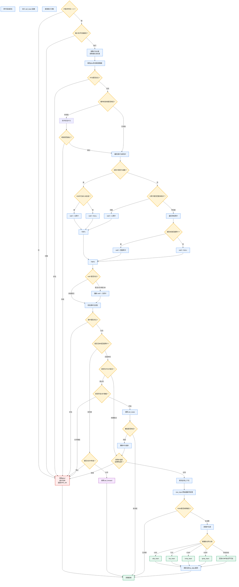
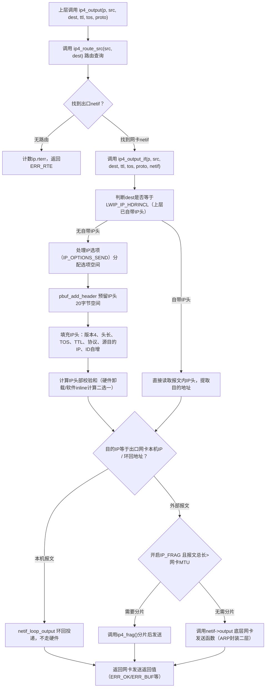
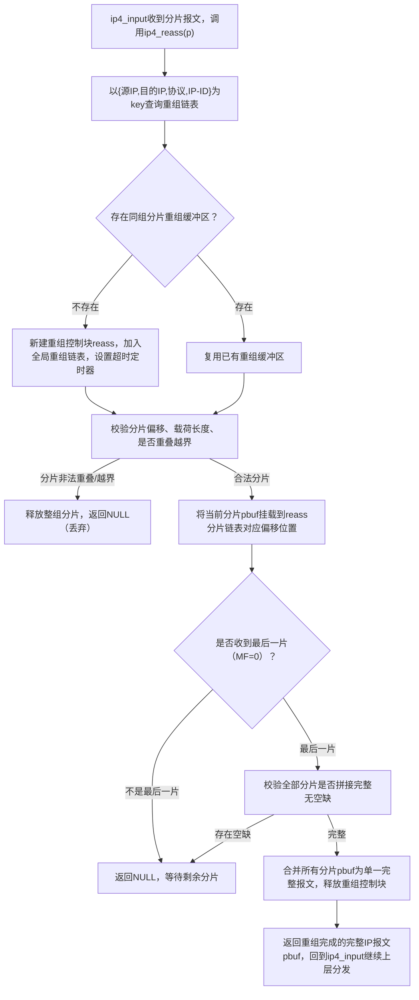

# lwIP src/core/ipv4/ip4.c 完整解析 + Mermaid流程图
## 一、文件整体概述
`ip4.c` 是 lwIP IPv4 协议栈**核心层实现文件**，承担三层核心职责：
1. **收包处理**：`ip4_input()` 网卡收包入口，IP头校验、分片重组、转发、上送TCP/UDP/ICMP/IGMP
2. **发包处理**：`ip4_output()`/`ip4_output_if()` 上层发包入口，路由查找、IP头封装、分片、网卡下发
3. **路由与转发**：`ip4_route()` 路由查询、`ip4_forward()` 跨网卡IP转发、组播默认网口管理
配套依赖：
- 分片重组：`ip4_frag.c`（`ip4_reass()` 分片重组、`ip4_frag()` 发包分片）
- 辅助：路由钩子、组播、DHCP特殊放行、IP校验和、统计计数

编译开关：`LWIP_IPV4=1` 才编译本文件。

# 二、三大核心函数 Mermaid 流程图
## 1. ip4_input() 收包总流程（网卡驱动回调入口）




##  （1）ip4_input()：IPv4报文接收主处理函数
### 函数作用
网卡收到以太网报文、剥离二层头后，驱动将**IP载荷pbuf**传入本函数；完成IP层全部接收逻辑，是IPv4下行入口。
### 阶段拆解
#### 阶段1：基础合法性校验（丢弃畸形报文）
1. IP版本校验：只处理IPv4（`IPH_V(iphdr) ==4`），IPv6直接丢弃
2. IP头长度校验：最小20字节，IP头不能跨pbuf分片，报文总长度不能小于二层实际载荷
3. IP头部校验和校验：无硬件卸载时软件计算`inet_chksum`，校验失败直接丢包
4. 全局缓存：把当前报文源/目的IP存入全局`ip_data`，方便全文件快速读取

#### 阶段2：匹配本机接收网卡netif（判断报文是不是发给本机）
分3种地址场景处理：
1. **组播目的IP**
   - 开启IGMP：仅网卡加入对应组播组才接收，允许IGMP查询报文源IP=0.0.0.0
   - 关闭IGMP：仅网卡配置IP且UP状态接收所有组播
2. **单播/广播目的IP**
   - 优先校验入网卡`inp`是否匹配本机IP/本网段广播（`ip4_input_accept()`）
   - 不匹配则遍历系统所有`netif`寻找匹配网卡
3. **DHCP特殊放行（IP_ACCEPT_LINK_LAYER_ADDRESSING）**
   - 网卡未配置IP、无匹配netif时，UDP目的端口68（DHCP客户端）强制放行，忽略目的IP校验

#### 阶段3：源IP合法性校验（RFC1122规范）
- 源IP不能是本网段广播、任何组播地址；
- 例外：DHCP报文、IGMP查询报文允许源IP=0.0.0.0

#### 阶段4：转发/本地接收分支
1. **无匹配网卡（不是本机报文）**
   - 开启`IP_FORWARD`且不是二层广播报文：调用`ip4_forward()`跨网卡转发
   - 否则直接丢弃报文
2. **匹配本机网卡（本机接收）**
   - 分片判断：IP头MF标记/分片偏移非0 → 进入分片重组`ip4_reass()`
   - IP选项过滤：`IP_OPTIONS_ALLOWED=0`时直接丢弃带IP选项报文（IGMP除外）

#### 阶段5：上层协议分发
1. 先交给RAW原始套接字 `raw_input()`，RAW消费报文则直接结束
2. 未被RAW消费：剥离IP头部20字节，只把传输层载荷传给对应协议：
   - TCP → `tcp_input()`
   - UDP/UDPLITE → `udp_input()`
   - ICMP → `icmp_input()`
   - IGMP → `igmp_input()`
3. 未知传输协议：发送ICMP 协议不可达差错报文

### 关键全局变量 `ip_data`
临时缓存当前正在处理报文的上下文，避免函数层层传参：
- `current_ip4_header`：当前IP头指针
- `current_netif`：本机接收网卡
- `current_input_netif`：报文原始入网卡
- `current_iphdr_src/dest`：报文源、目的IP

## （2）ip4_output() / ip4_output_if()：IPv4报文发送链路
### 分层调用关系
**注意：**

    1. **收包处理**：`ip4_input()` 网卡收包入口，IP头校验、分片重组、转发、上送TCP/UDP/ICMP/IGMP

    2. **发包处理**：`ip4_output()`/`ip4_output_if()` 上层发包入口，路由查找、IP头封装、分片、网卡下发

    3. **路由与转发**：`ip4_route()` 路由查询、`ip4_forward()` 跨网卡IP转发、组播默认网口管理
```
上层应用(TCP/UDP/RAW)
    ↓
ip4_output() 【路由查询入口】
    ↓
ip4_output_if() 【基础IP头封装入口】
    ↓
ip4_output_if_opt() 【带IP选项封装】
    ↓
ip4_output_if_opt_src() 【最终IP头构建、校验和、分片、下发】
```


## 2. ip4_output() 发包总流程（上层TCP/UDP/RAW发包入口）

### （1）ip4_output() 核心逻辑
仅做**路由查询**，无IP封装逻辑：
1. `ip4_route_src(src, dest)` 带源地址的路由钩子查询出口网卡
2. 无路由返回`ERR_RTE`；找到网卡调用`ip4_output_if`

### （2）ip4_output_if_opt_src() 核心发包逻辑（底层实现）
#### 分支A：上层未携带IP头（绝大多数场景，TCP/UDP发包）
1. 分配IP头空间：`pbuf_add_header(p, IP_HLEN)` 在载荷头部腾出20字节IP头空间
2. 填充标准IPv4头部字段：
   - 版本4、头长度、TOS、TTL、传输层协议号
   - 目的IP：入参`dest`
   - 源IP：入参`src`为ANY则自动填充出口网卡IP
   - IP标识ID：全局静态`ip_id`自增，用于分片重组区分报文
   - 分片偏移初始0（不分片）
3. IP校验和计算两种模式：
   - `LWIP_INLINE_IP_CHKSUM=1`：逐字段累加快速计算
   - 关闭inline：调用通用`inet_chksum`计算完整IP头校验和
   - 网卡支持IP校验和硬件卸载：校验和填0，硬件自动填充
4. IP选项处理（`IP_OPTIONS_SEND`）：额外扩展IP头，4字节对齐填充0

#### 分支B：上层传入`LWIP_IP_HDRINCL`（RAW套接字自定义完整IP头）
1. 不封装IP头，直接复用pbuf自带IP头
2. 仅读取目的IP用于路由/二层ARP寻址

#### 发包前处理
1. 环回判断：目的IP为本机网卡IP/环回地址 → `netif_loop_output` 内存环回投递，不走硬件网卡
2. MTU分片判断：报文总长度 > 网卡MTU 且开启`IP_FRAG` → 调用`ip4_frag()`拆分多片IP报文发送
3. 最终下发：调用网卡驱动注册的`netif->output()`，完成ARP查询、封装以太网头，发送到硬件


##  3. ip4_reass() IP分片重组流程（ip4_input分片分支调用，位于ip4_frag.c，ip4.c仅调用）


## 3.3 ip4_reass() IP分片重组（定义在ip4_frag.c，ip4.c分片路径唯一调用点）
### 触发时机
`ip4_input()`收到IP分片报文（IP头MF置1 或分片偏移>0）时调用。
### 重组核心机制
1. **重组五元组key**：源IP、目的IP、传输协议、IP标识ID，相同五元组判定为同一报文分片
2. 重组缓冲区链表：全局维护`reass`链表，每个节点存储一组分片的全部pbuf、总长度、超时时间
3. 分片合法性检查：
   - 分片偏移*8 + 当前分片载荷长度 不能超过报文总长度
   - 分片载荷不能和已有分片重叠覆盖
4. 拼接逻辑：
   - 非最后分片（MF=1）：存入缓冲区，返回NULL，等待后续分片
   - 收到最后分片（MF=0）：遍历缓冲区检查分片是否无空缺、完整拼接
5. 完整拼接成功：合并所有分片pbuf为单个连续报文，删除重组缓冲区，返回完整IP pbuf给`ip4_input()`
6. 超时清理：lwIP定时任务遍历重组链表，超时未收齐分片直接释放全部缓冲区，防内存泄露

# 四、配套辅助函数简要说明
1. `ip4_route()`：基础路由查询，遍历所有网卡匹配子网掩码；组播优先使用默认组播网卡`ip4_default_multicast_netif`
2. `ip4_route_src()`：支持源地址路由钩子`LWIP_HOOK_IP4_ROUTE_SRC`，自定义复杂路由策略
3. `ip4_forward()`：IP跨网卡转发，TTL减1，TTL=0发送ICMP超时；转发前校验禁止转发广播/组播/本地链路地址；超MTU则分片或发送ICMP需分片差错
4. `ip4_input_accept()`：判断单播/广播报文是否属于当前网卡
5. `ip4_debug_print()`：IP头格式化打印，IP_DEBUG开启时调试输出报文头信息
6. `ip4_set_default_multicast_netif()`：设置组播报文默认发送网卡

# 五、配置宏开关对应本文件功能
| 宏 | 作用 |
|----|------|
| LWIP_IPV4 | 总开关，关闭则整个ip4.c不编译 |
| IP_FORWARD | 开启三层跨网卡路由转发功能 |
| IP_REASSEMBLY | 开启IP分片重组（ip4_reass） |
| IP_FRAG | 开启发送时大报文IP分片（ip4_frag） |
| LWIP_IGMP | 支持组播接收过滤 |
| LWIP_DHCP | DHCP报文特殊放行逻辑 |
| CHECKSUM_GEN_IP / CHECKSUM_CHECK_IP | 软件IP校验和生成/校验 |
| LWIP_INLINE_IP_CHKSUM | 快速inline计算IP头校验和 |
| IP_OPTIONS_SEND / IP_OPTIONS_ALLOWED | 支持IP选项收发 |
| IP_DEBUG | 开启ip4_debug_print调试打印 |


