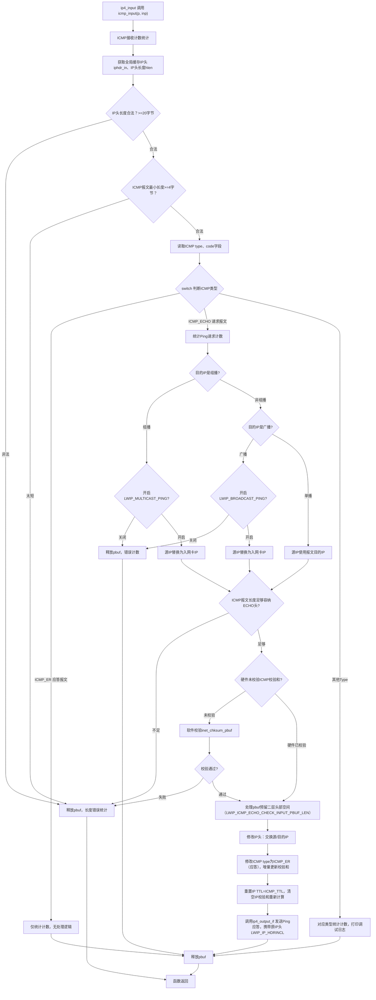
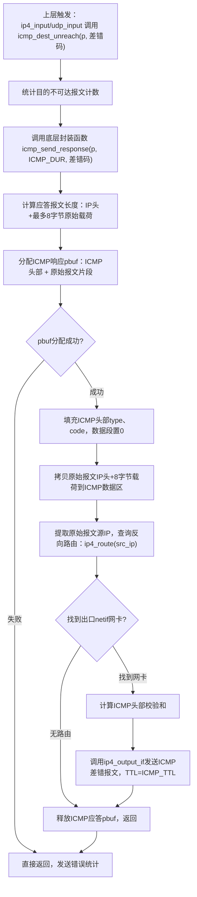

# lwIP icmp.c 完整解析 + Mermaid流程图
## 一、文件整体概述
`icmp.c` 是 IPv4 ICMP 控制报文实现文件，依赖宏开关 `LWIP_IPV4 && LWIP_ICMP` 编译。
核心职责：
1. **接收处理**：`icmp_input()`，由 `ip4_input()` 调用，处理收到的ICMP报文（重点实现Ping应答ECHO_REPLY）；
2. **差错报文发送**：
   - `icmp_dest_unreach()`：目的不可达（端口/协议/分片需要不分片等场景）；
   - `icmp_time_exceeded()`：TTL超时（三层转发TTL减为0时调用）；
3. **底层发送封装**：静态函数 `icmp_send_response()`，统一构造ICMP差错报文并调用IP层发包。

ICMP 属于**网络层控制协议**，报文封装在IP报文中，协议号 `IP_PROTO_ICMP=1`。

---

# 二、核心函数 Mermaid 竖向流程图（无渲染冲突）
## 2.1 icmp_input() 完整收包处理流程图

## 3.1 icmp_input() ICMP报文接收处理函数
### 调用入口
`ip4_input()` 分发传输层报文时，识别协议号 `IP_PROTO_ICMP`，剥离IP头后调用本函数。
入参：
- `p`：pbuf载荷，`p->payload` 直接指向ICMP头部；
- `inp`：接收该ICMP报文的网卡netif。

### 完整执行阶段拆解
#### 阶段1：基础合法性校验
1. 读取全局缓存的当前IP头部，校验IP头长度最小20字节；
2. 校验ICMP报文至少4字节（type+code+校验和），长度不足直接丢弃；
3. 读取ICMP头部的`type`类型字段，进入分支判断。

#### 阶段2：分支1 — ICMP_ER（ECHO_REPLY Ping应答）
仅做统计计数，不做任何业务处理：Ping应答由上层RAW套接字接收，协议栈无处理逻辑。

#### 阶段3：分支2 — ICMP_ECHO（Ping请求，核心Ping应答逻辑）
1. **广播/组播Ping权限控制**
   - 目的IP为组播：需开启 `LWIP_MULTICAST_PING` 才允许回复，源IP强制改为接收网卡本机IP；
   - 目的IP为广播：需开启 `LWIP_BROADCAST_PING` 才允许回复；
   - 单播Ping：应答报文源IP = 原请求报文的目的IP。
2. **ICMP报文长度校验**：必须容纳完整`icmp_echo_hdr`（8字节），太短直接丢弃。
3. **ICMP校验和校验**：网卡无硬件校验时，软件计算完整ICMP pbuf校验和，失败丢弃。
4. **pbuf空间重分配（关键优化）**
   接收报文剥离了二层以太网头，直接复用pbuf发送应答时缺少二层头部预留空间；
   `LWIP_ICMP_ECHO_CHECK_INPUT_PBUF_LEN` 开启时：
   - 尝试向前扩容pbuf，预留链路层头部；
   - 扩容失败则新建RAM类型pbuf，拷贝IP+ICMP数据，释放原始缓冲区。
5. **改造IP+ICMP头部，生成应答报文**
   - IP头：交换源IP、目的IP；
   - ICMP头：type从`ICMP_ECHO`改为`ICMP_ER`；增量修正校验和；
   - 重置IP TTL为默认ICMP_TTL，重新计算IP头部校验和。
6. **发送应答**
   调用`ip4_output_if()`，传入标记`LWIP_IP_HDRINCL`，告知IP层pbuf已自带完整IP头，无需重新封装。
7. 流程末尾统一释放原始pbuf缓冲区。

#### 阶段4：分支3 — 所有其他ICMP类型（差错报文、重定向、时间戳等）
仅做统计计数、打印调试日志，lwIP基础版本**不主动处理入站差错报文**，差错报文仅用于上层RAW套接字读取。

### 关键细节
1. Ping应答**复用原始请求报文pbuf**，减少内存分配开销；
2. 组播/广播Ping默认关闭，防止局域网泛洪攻击；
3. 报文全部处理完毕必须释放pbuf，避免内存泄漏。

## 2.2 icmp_dest_unreach() + icmp_send_response() 差错报文发送流程图

## 3.2 icmp_dest_unreach() 目的不可达差错发送函数
### 函数作用
主动构造并发送**ICMP目的不可达差错报文**，告知对端：发送的IP报文无法交付。
### 触发场景
1. `ip4_input()`收到未知传输协议（如IP_PROTO=99无对应处理函数）；
2. `udp_input()`收到报文目的端口无绑定套接字；
3. 分片报文DF位置1、且超过出口网卡MTU（差错码ICMP_DUR_FRAG）。

### 入参说明
- `p`：触发差错的原始IP报文，`p->payload`指向完整IP头部；
- `t`：差错子类型码（端口不可达、协议不可达、需要分片等）。

### 执行逻辑
1. 统计MIB计数：icmpoutdestunreachs；
2. 直接调用底层通用封装函数 `icmp_send_response(p, ICMP_DUR, t)`，复用统一差错报文构造逻辑。

## 3.3 底层通用封装 icmp_send_response()（被icmp_dest_unreach/icmp_time_exceeded调用）
### 核心功能
统一构造所有ICMP差错报文（目的不可达、TTL超时），消除重复代码。
### 执行步骤
1. 确定ICMP差错报文载荷：固定携带**原始报文IP头部 + 最多8字节上层载荷**（RFC791标准）；
2. 分配全新pbuf，空间为 ICMP头部(8字节) + 原始报文片段；
3. 填充ICMP头部type、code，数据段置0；
4. 将原始IP头+8字节数据拷贝到ICMP报文的数据区；
5. **反向路由查询**：差错报文要回复给原始报文的源IP，以原始源IP为目的地址查询出口netif；
6. 计算ICMP校验和；
7. 调用`ip4_output_if()`发送ICMP差错报文，TTL使用ICMP默认值；
8. 释放新建的ICMP应答pbuf。

### RFC规范关键点
ICMP差错报文**禁止再触发新的ICMP差错**：代码内通过路由查询、长度截断规避循环差错。

## 3.4 辅助函数 icmp_time_exceeded()
### 触发场景
1. `ip4_forward()`三层转发时，IP报文TTL减至0；
2. IP分片重组超时未收齐全部分片。
### 逻辑
和`icmp_dest_unreach`完全一致，仅传入ICMP类型为`ICMP_TE`，复用`icmp_send_response`发送超时差错报文。

---

# 四、icmp.c 全局调用链路总览
## 接收链路（下行：链路层 → IP层 → ICMP）
网卡驱动 → ethernet_input → ip4_input → icmp_input
## 发送链路（上行：各模块 → ICMP差错函数 → IP层）
1. UDP端口无套接字 → udp_input → icmp_dest_unreach
2. 未知传输协议 → ip4_input → icmp_dest_unreach
3. 转发TTL=0 → ip4_forward → icmp_time_exceeded
4. Ping请求回复 → icmp_input内部直接调用 ip4_output_if
5. 分片重组超时 → ip4_reass → icmp_time_exceeded

## 五、重要配置宏说明
| 宏 | 作用 |
|----|------|
| LWIP_ICMP | ICMP总开关，关闭则整个文件不编译 |
| LWIP_MULTICAST_PING | 开启组播Ping应答功能 |
| LWIP_BROADCAST_PING | 开启广播Ping应答功能 |
| LWIP_ICMP_ECHO_CHECK_INPUT_PBUF_LEN | Ping应答时自动处理pbuf二层头部空间 |
| ICMP_DEST_UNREACH_DATASIZE | 差错报文携带原始载荷最大字节数（固定8） |
| CHECKSUM_GEN_ICMP / CHECKSUM_CHECK_ICMP | ICMP校验和软件生成/校验开关 |