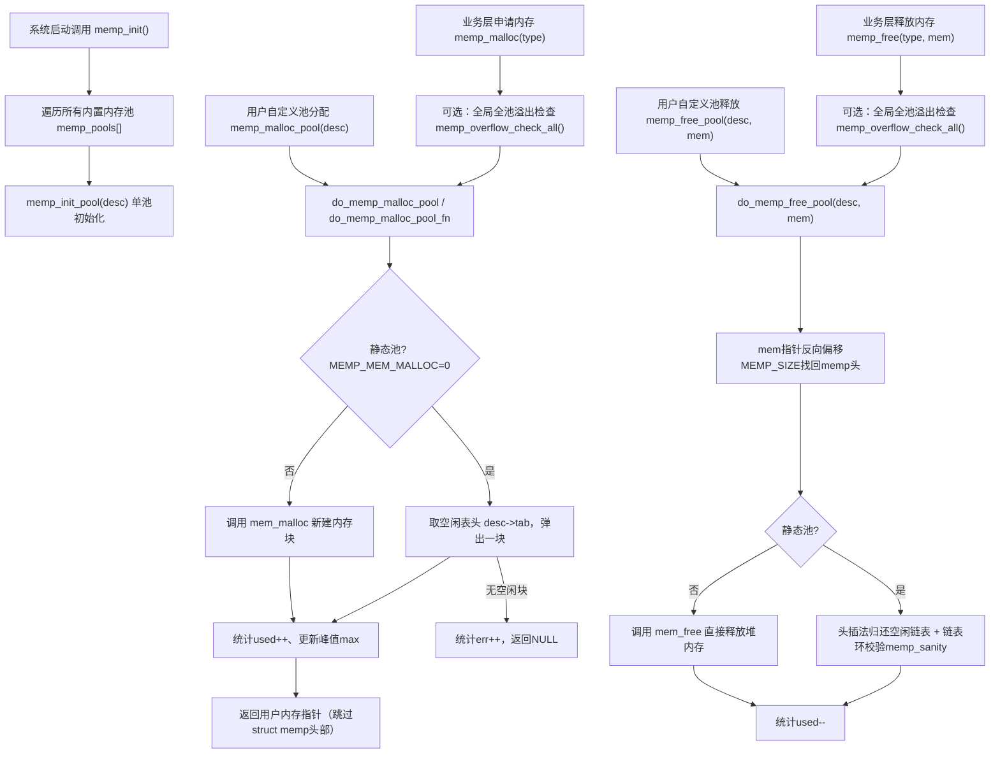
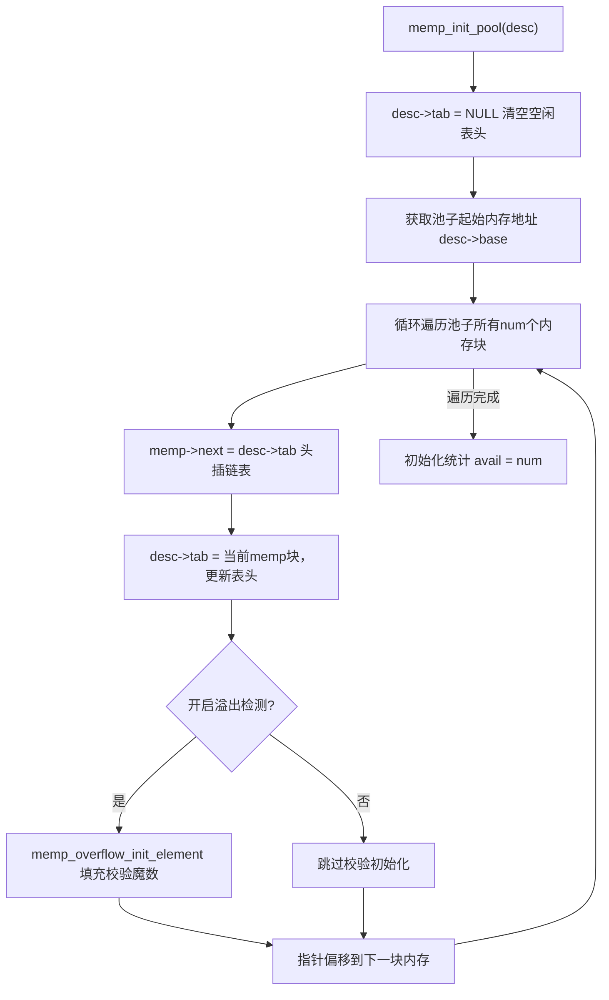
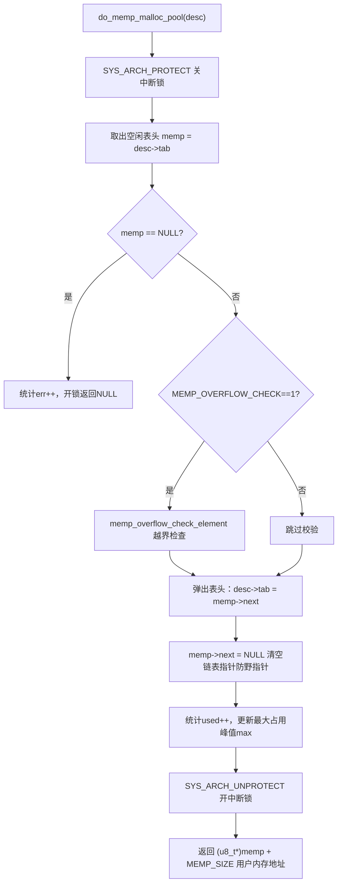
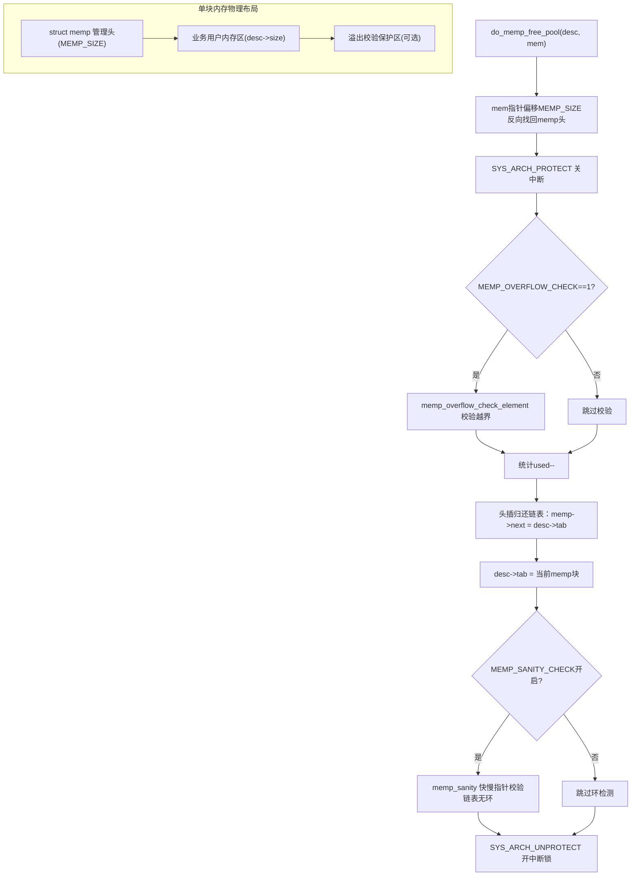
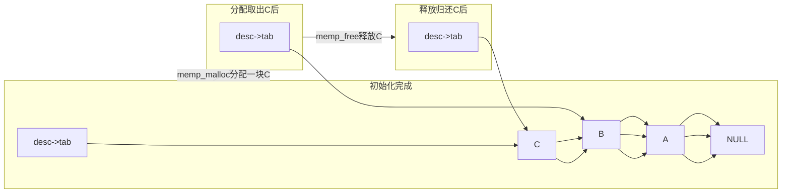

# 整体总结

# lwIP memp.c 完整Mermaid流程图（分4张，可直接复制到Markdown渲染）
## 1. 整体函数调用层级图


## 2. 静态内存池初始化流程（MEMP_MEM_MALLOC=0）


## 3. 静态池分配单块完整逻辑


## 4. 静态池释放单块+内存布局示意


## 5. 静态池空闲链表状态变化时序图（极简）


### 使用说明
1. 全部代码块复制到支持Mermaid的文档工具（Typora、VSCode+Mermaid插件、GitBook、PPT插件）可直接渲染图形；
2. 优先使用**图1整体调用图 + 图3分配 + 图4释放**组合放进课程报告；
3. 若只允许一张大图，我可以把5张合并为单张综合总图。

---

### 📌 图解一：`memp_init()` —— “建厂串链”

**此阶段核心**：把散装内存用 `next` 指针串成单链表，`*tab` 指向链头（块0）。

```text
【物理内存布局】（连续的一大块数组）
┌─────────────────────────────────────────────────────────────┐
│ 块0 (头部+数据)  │ 块1 (头部+数据)  │ 块2 (头部+数据)  │
└─────────────────────────────────────────────────────────────┘

【memp_init 执行后：构建逻辑空闲链表】

   *tab (空闲链表头指针)
        │
        ▼
   ┌─────────┐    ┌─────────┐    ┌─────────┐
   │  块 0   │───▶│  块 1   │───▶│  块 2   │───▶ NULL
   │next=地址1│    │next=地址2│    │next=NULL │
   └─────────┘    └─────────┘    └─────────┘
   (空闲)          (空闲)          (空闲)
```

---

### 📌 图解二：`memp_malloc(type)` —— “摘走链头”

**此阶段核心**：把 `*tab` 指向的【块0】摘下来给用户，`*tab` 后移指向【块1】。

```text
【执行动作】：
1. memp = *tab;        // memp 指向块0
2. *tab = memp->next;  // 关键！tab 现在指向块1 (跳过块0)
3. return (u8_t*)memp + 头部大小; // 把块0的数据区地址返回给用户

【执行后的逻辑链表】：

   *tab (空闲链表头指针)  <--- 指针后移了！
        │
        ▼
   ┌─────────┐    ┌─────────┐
   │  块 1   │───▶│  块 2   │───▶ NULL
   │next=地址2│    │next=NULL │
   └─────────┘    └─────────┘
   (空闲)          (空闲)

   ╔═══════════════════════════╗
   ║  ┌─────────┐              ║
   ║  │  块 0   │  (已被用户拿走) ║
   ║  │数据区   │ ◀── 返回给用户的指针
   ║  └─────────┘              ║
   ╚═══════════════════════════╝
```

---

### 📌 图解三：`memp_free(type, mem)` —— “头插还原”

**此阶段核心**：用户归还【块0】，代码通过地址反推头部，强行把【块0】插回链表最前面。

```text
【执行动作】：
1. memp = (struct memp *)((u8_t *)mem - 头部大小); // 反推出块0的头部
2. memp->next = *tab;  // 让块0的next指向当前头节点(块1)
3. *tab = memp;        // 关键！tab 重新指向块0

【执行后的逻辑链表】（完美恢复到了图一的状态）：

   *tab (空闲链表头指针)  <--- 指针拨回原处！
        │
        ▼
   ┌─────────┐    ┌─────────┐    ┌─────────┐
   │  块 0   │───▶│  块 1   │───▶│  块 2   │───▶ NULL
   │next=地址1│    │next=地址2│    │next=NULL │
   └─────────┘    └─────────┘    └─────────┘
   (重新空闲)      (空闲)          (空闲)
```

---

### 🔍 附赠图解：`memp_free` 是如何通过地址找到头部的？（微观解剖图）

你在 `memp_free` 里肯定对这句代码最困惑：  
`memp = (struct memp *)(void *)((u8_t *)mem - MEMP_SIZE);`

请看下面这个内存块的微观结构，一看就懂：

```text
【一个内存块的实际存储布局】（地址从低到高）

低地址  ┌──────────────────────────────┐ 高地址
       │   头部 (struct memp)          │
       │   包含 next 指针              │  <--- 这里的地址 = 块基址
       │   大小 = MEMP_SIZE            │
       ├──────────────────────────────┤
       │                              │
       │   数据区 (用户实际能用的空间)  │  <--- mem 指针指向这里
       │   大小 = desc->size          │      (memp_malloc 返回的就是这个地址)
       │                              │
       └──────────────────────────────┘

当调用 memp_free(type, mem) 时：
传入的 mem 指向数据区起始。
代码执行：基址 = (u8_t*)mem - MEMP_SIZE
这样就精准找到了头部，然后才能修改 head->next 指针把它接回链表！
```

---

### 🎬 动态剧情回顾（三张图串起来）

| 阶段 | 执行函数 | `*tab` 指向 | 链表状态 |
| :--- | :--- | :--- | :--- |
| **开局** | `memp_init` | **块0** | 块0 ➔ 块1 ➔ 块2 ➔ NULL |
| **申请** | `memp_malloc` | **块1**（后移） | 块1 ➔ 块2 ➔ NULL （块0被拿走） |
| **归还** | `memp_free` | **块0**（拨回） | 块0 ➔ 块1 ➔ 块2 ➔ NULL （完美复原） |

**核心规律**：`memp_malloc` 是**“出栈”**（Pop），`memp_free` 是**“入栈”**（Push）。整个内存池就是一个**后进先出（LIFO）的栈**，而 `*tab` 就是**栈顶指针**。

现在看着这三张图，再回看代码里的 `*desc->tab = memp->next;` 和 `memp->next = *desc->tab; *desc->tab = memp;`，是不是觉得无比清晰了？这其实就是数据结构里最基础的“链表头插/头删”操作，只是被包装在了网络协议栈里而已。


# memp.c——memp_init(void)
---

### 📌 函数定位：内存池的“总司令”
此函数在 lwIP 协议栈启动早期被调用（通常在 `lwip_init()` 中）。它**不负责具体切内存**，而是负责**遍历所有已注册的池类型**，并调度底层初始化函数，最后做一次全局健康检查。

---

### 🔍 逐行源码深度拆解

#### 1. 循环控制：`u16_t i;` 与 `LWIP_ARRAYSIZE(memp_pools)`
```c
for (i = 0; i < LWIP_ARRAYSIZE(memp_pools); i++) {
```
- **`LWIP_ARRAYSIZE`**：这是 lwIP 定义的宏，等价于 `sizeof(array) / sizeof(array[0])`，用于在编译期计算数组元素个数。
- **关键谜团 `memp_pools`**：这个数组**并不是在某个 `.c` 文件中显式写死的**，而是通过**X-Macro（宏重载）**技术在编译期动态生成的。
  - 在 `memp.c` 的开头，`#include "lwip/priv/memp_std.h"` 之前，`LWIP_MEMPOOL` 这个宏被定义成声明外部结构体。
  - 在定义 `memp_pools[]` 数组时，**再次包含** `memp_std.h`，此时 `LWIP_MEMPOOL` 被重定义为列出池描述符指针。
  - **结论**：循环次数由你开启的协议功能（`MEMP_NUM_TCP_PCB`、`MEMP_NUM_PBUF_POOL` 等）在编译期确定，运行时不动态变化。

#### 2. 核心调度：`memp_init_pool(memp_pools[i]);`
- 这是本函数的**实质工作执行者**。
- `memp_pools[i]` 是 `const struct memp_desc*`（池描述符指针），包含该池的**基址(`base`)**、**空闲链表头指针(`tab`)**、**总数量(`num`)**、**单元大小(`size`)** 以及统计信息。
- **它在做什么**：将 `desc->base` 指向的那一大块连续静态数组（编译期分配），按照 `desc->size + MEMP_SIZE` 的大小进行切割，并通过 `next` 指针串联成一个单向空闲链表，最终让 `*desc->tab` 指向链表的第一个节点。

#### 3. 统计挂接：`#if LWIP_STATS && MEMP_STATS`
```c
#if LWIP_STATS && MEMP_STATS
    lwip_stats.memp[i] = memp_pools[i]->stats;
#endif
```
- **作用**：将当前池的统计结构体指针（`stats`）挂载到全局统计数组 `lwip_stats.memp[i]` 上。
- **工程价值**：虽然初始化时它不操作内存，但这一步至关重要。当系统跑起来后，你可以通过 `lwip_stats.memp[i]->used`、`->max`、`->err` 实时观察每个池的峰值占用和分配失败次数。**这是排查内存泄漏和池容量不足的第一手数据来源**。
- **注意**：这个赋值只发生在循环内部，因为每个池的 `desc->stats` 是独立的。

#### 4. 启动时暴力体检：`#if MEMP_OVERFLOW_CHECK >= 2`
```c
#if MEMP_OVERFLOW_CHECK >= 2
  memp_overflow_check_all();
#endif
```
- **触发条件**：必须在 `lwipopts.h` 中将 `MEMP_OVERFLOW_CHECK` 定义为 **2 或以上**（严格模式）。
- **为什么是 `>= 2` 而不是 `1`？**
  - `MEMP_OVERFLOW_CHECK == 1`：只在每次调用 `memp_malloc` 和 `memp_free` 时，**检查被操作的那一个节点**的魔数（头部/尾部哨兵）。
  - `MEMP_OVERFLOW_CHECK >= 2`：在系统启动完毕、业务跑起来之前，**把当前所有池的所有节点全部扫描一遍**，确认静态数组在初始化过程中没有被意外踩坏。
- **执行内容**：遍历所有池，取出每个节点，检查其头部前 `MEM_SANITY_REGION_BEFORE` 和尾部后 `MEM_SANITY_REGION_AFTER` 填入的固定魔数是否被篡改。
- **意义**：嵌入式开发中，连接脚本（Linker Script）或启动文件（Startup）的细微错误可能导致 BSS 段初始化异常，这个检查能把问题扼杀在摇篮里。

---

### 📊 完整执行流程图

```text
memp_init() 被调用（协议栈启动）
    │
    ├─► for (i = 0; i < 池子总数; i++) 
    │       │
    │       ├─► memp_init_pool(desc) 
    │       │       └─► 将 desc->base 大数组切成 N 个等大小节点
    │       │       └─► 用 next 指针串成单向空闲链表
    │       │       └─► *desc->tab 指向第一个空闲节点
    │       │
    │       └─► [如果开启统计] lwip_stats.memp[i] = desc->stats;
    │
    └─► [如果开启二级溢出检测] memp_overflow_check_all()
            └─► 遍历所有池的所有节点，校验头部/尾部魔数
```


---

### 🧠 总结（一句话背书）
> **`memp_init` 是总指挥，它不干活，只负责调度所有池执行 `memp_init_pool` 来切分内存，顺带挂接调试钩子；它的极简风格源于 lwIP 将“策略”与“机制”分离，所有可变参数全被编译期宏固化，造就了极高的运行时效率。**


# memp.c—— memp_malloc(memp_t type)

---

### 🔍 剥离干扰，单独剖析 `memp_malloc`

让我们只看 `memp_malloc` 本身的逻辑，它确实就这么短，因为**它只做“策略调度”**，把“具体怎么拿内存”甩给了 `do_memp_malloc_pool`。

```c
void *
#if !MEMP_OVERFLOW_CHECK
memp_malloc(memp_t type)          // 常规版本：只传类型
#else
memp_malloc_fn(memp_t type, const char *file, const int line) // 调试版本：多传文件名和行号
#endif
{
  void *memp;
  
  // 1. 合法性检查：确保请求的池类型索引没有越界
  LWIP_ERROR("memp_malloc: type < MEMP_MAX", (type < MEMP_MAX), return NULL;);

  // 2. 严格溢出检测：如果开启了二级检测，每次分配前扫描所有池的所有节点（巨慢，仅调试用）
#if MEMP_OVERFLOW_CHECK >= 2
  memp_overflow_check_all();
#endif

  // 3. 调用底层真正的分配函数
#if !MEMP_OVERFLOW_CHECK
  memp = do_memp_malloc_pool(memp_pools[type]);      // 常规：传入池描述符
#else
  memp = do_memp_malloc_pool_fn(memp_pools[type], file, line); // 调试：额外传文件行号
#endif

  // 4. 返回分配到的内存块地址（实际数据区，非头部）
  return memp;
}
```

---

### 🧠 源码里的三个设计细节（面试必考点）

| 代码特征 | 背后的工程智慧 |
| :--- | :--- |
| **`LWIP_ERROR` 宏** | 即使 `type` 传错了（比如大于 `MEMP_MAX`），也不会立即死机（取决于宏定义），而是优雅返回 `NULL`。这在协议栈中非常重要，防止恶意/错误调用导致系统崩溃。 |
| **`#if MEMP_OVERFLOW_CHECK >= 2` 放在入口处** | 这是一个**“暴力调试开关”**。如果你打开它，每次调用 `memp_malloc` 都会遍历成千上万个内存块检查魔数，**系统性能会急剧下降**，但能精准定位是哪次操作踩了内存。工作中只允许在 Debug 阶段开启。 |
| **条件编译改变函数名（`memp_malloc` vs `memp_malloc_fn`）** | 当开启溢出检测时，函数名变成了 `_fn` 版本，并且多了 `file` 和 `line` 参数。这是为了让底层在发现溢出时，能**精准打印出是哪个文件的哪一行申请了这块内存**，极大提升调试效率。 |

---

### 📝 总结（一句话记忆）

> **`memp_malloc` 就是个“前台接待员”**：它只负责检查传参（`type`是否合法）、决定是否叫保安来做全身扫描（`>=2`级检测），然后把客人（内存申请请求）转交给后厨干活（`do_memp_malloc_pool`），最后把做好的菜（内存地址）端出来。

如果面试官再问你：“`memp_malloc` 做了什么？”你把这 4 个步骤（检查→可选扫描→调用底层→返回）清晰讲出来，并且能顺带提一句“真正的切割操作在下层”，这道题就是满分。


# memp.c —— memp_free(memp_t type, void *mem)
好的，我们来对 `memp_free(memp_t type, void *mem)` 做一次**源码级、逐行深度解剖**。这个函数是 `memp_malloc` 的“完美对称操作”，但它在释放逻辑之外，还挂载了一个**非常精妙的生产者-消费者钩子机制**，这是很多高级工程师都会忽略的细节。

---

### 📌 函数签名与定位
```c
void memp_free(memp_t type, void *mem)
```
- **作用**：将之前通过 `memp_malloc(type)` 申请到的内存块 `mem`，归还给 `type` 指定的池。
- **关键契约**：**类型必须匹配**（用 `PBUF` 池申请的绝不能还给 `TCP_PCB` 池），否则链表指针会错乱，导致系统硬崩溃。

---

### 🔍 逐行源码执行流程图解

我把函数执行分为 **6 个明确的逻辑阶段**：

#### 阶段一：参数合法性校验（快速失败）
```c
LWIP_ERROR("memp_free: type < MEMP_MAX", (type < MEMP_MAX), return;);
```
- **作用**：确保传入的池类型索引没有越界。如果 `type >= MEMP_MAX`，直接 `return`（取决于 `LWIP_ERROR` 宏定义，可能是打印错误后返回，或触发断言）。
- **设计哲学**：先检查 `type`，**再检查 `mem == NULL`**。为什么要这个顺序？因为如果 `type` 非法，去解引用 `memp_pools[type]` 会直接导致内存访问异常（HardFault）。先校验 `type` 保证了后续所有数组访问的安全性。

#### 阶段二：空指针安全处理（容错）
```c
if (mem == NULL) {
    return;
}
```
- **作用**：允许传入 `NULL` 并静默返回。这在协议栈中非常常见，例如上层调用 `pbuf_free(NULL)` 时，底层不会崩溃，而是直接忽略。**这是防御式编程的典范**。

#### 阶段三：暴力全局溢出检测（调试屠龙刀）
```c
#if MEMP_OVERFLOW_CHECK >= 2
  memp_overflow_check_all();
#endif
```
- **作用**：如果开启了最高级溢出检测，每次释放前，遍历**所有池的所有节点**，检查头部/尾部魔数是否被改写。
- **⚠️ 性能警告**：这个操作是 O(N) 复杂度的全量扫描。如果你的 `MEMP_NUM_PBUF_POOL` 配置了上千个，每一次 `memp_free` 都会卡顿毫秒级。**强烈建议仅在内核 Debug 阶段开启，Release 必须关闭。**

#### 阶段四：捕获空闲链表“空转非空”的瞬间（钩子前置）
```c
#ifdef LWIP_HOOK_MEMP_AVAILABLE
  struct memp *old_first;
  old_first = *memp_pools[type]->tab;
#endif
```
- **核心魔术**：在执行真正的释放之前，**先把当前池的空闲链表头指针（`*tab`）保存下来**。
- **目的**：我们需要知道释放这块内存**之前**，这个池是否处于“弹尽粮绝”的状态（即 `*tab == NULL`）。

#### 阶段五：执行核心释放操作（重量级选手）
```c
do_memp_free_pool(memp_pools[type], mem);
```
- **执行内容**：这是真正的“搬砖工”。
  1. 通过 `(u8_t*)mem - MEMP_SIZE` 反推头部结构体 `struct memp`。
  2. 关中断（`SYS_ARCH_PROTECT`）。
  3. [若开启溢出检测] 校验当前节点的魔数。
  4. 更新统计：`desc->stats->used--`。
  5. **头插法放回**：`memp->next = *desc->tab; *desc->tab = memp;`。
  6. 开中断。

#### 阶段六：触发“资源可用”钩子（高级唤醒机制）
```c
#ifdef LWIP_HOOK_MEMP_AVAILABLE
  if (old_first == NULL) {
    LWIP_HOOK_MEMP_AVAILABLE(type);
  }
#endif
```
- **灵魂拷问**：为什么要在释放**之后**判断 `old_first == NULL`？
- **完美解答**：`old_first` 保存的是释放前的链表头。如果释放前链表头是 `NULL`，说明这个池在释放前**已经没有任何空闲块了**。现在你归还了一块，池子从“空”变成了“非空”。
- **工程应用**：`LWIP_HOOK_MEMP_AVAILABLE(type)` 是一个**弱函数钩子**（Weak Function）。用户可以在自己的代码中重写这个函数。做什么用？**唤醒那些因为申请不到内存而阻塞在高优先级任务中的线程**。例如，一个 TCP 发送任务因申请不到 PBUF 而睡眠，当 PBUF 池有可用块时，钩子触发释放信号量，唤醒该任务。这是 **lwIP 实现零死锁等待的底层基石**。

---

### 📊 完整执行时序图

```text
开始 memp_free(type, mem)
    │
    ├─ 1. 检查 type < MEMP_MAX ──── 失败 ──► return（安全退出）
    │
    ├─ 2. 检查 mem == NULL ──────── 是 ──► return（静默忽略）
    │
    ├─ 3. [如果 ≥2级溢出] 扫描所有池，校验魔数
    │
    ├─ 4. 保存释放前的空闲链表头: old_first = *tab
    │
    ├─ 5. 调用 do_memp_free_pool
    │       ├─ 计算头部地址
    │       ├─ 关中断
    │       ├─ 校验当前节点魔数
    │       ├─ used--（统计减1）
    │       ├─ 头插法放回链表
    │       └─ 开中断
    │
    └─ 6. 如果 old_first == NULL（之前池是空的）
            └─► 调用 LWIP_HOOK_MEMP_AVAILABLE(type) 
                 （通知外界：现在有货了！）
```

---

### 🎯 面试高频追问 & 满分应答技巧

| 面试官挖坑点 | 你的满分应答（展示资深视角） |
| :--- | :--- |
| **“为什么释放前要保存 `old_first`，而不是释放后直接判断 `*tab`？”** | 因为释放后 `*tab` 肯定不为空（至少刚释放的这块在链头）。只有保存释放前的状态，才能准确捕捉“由空变非空”的**边沿触发事件**，避免重复唤醒。 |
| **“如果不开启 `LWIP_HOOK_MEMP_AVAILABLE`，这个函数是不是就没用了？”** | 不是。钩子只是附加功能。核心功能是归还内存给空闲链表，保证后续 `memp_malloc` 能复用这块内存，防止内存泄漏。 |
| **“释放时为什么要关中断（`SYS_ARCH_PROTECT`）？”** | 因为 `memp_free` 可能在中断上下文（如网卡接收中断）和线程上下文同时被调用。操作链表是**临界区**，必须关中断保护，防止链表指针在修改过程中被中断打断导致损坏。 |
| **`LWIP_ERROR` 宏在 Release 模式下会怎样？** | 通常在 Release 模式下，该宏会被定义为空操作或仅打印日志，不会触发断言死机。这保证了协议栈在正式产品中的鲁棒性，即使上层传错参数也能优雅返回。 |

---

### 💡 总结（一句话背记）

> **`memp_free` 不只是把内存块插回链表，它还是一个“资源可用性广播器”：通过保存前置状态，精准感知池从“枯竭”到“可用”的瞬间，并借助钩子函数实现高效的阻塞唤醒机制。**

在面试中，如果你能把“`old_first` 是用来感知边沿触发”这个点讲清楚，面试官会立刻认定你**不仅有编码能力，还有深刻的操作系统并发思维**，这是远超实习生的加分项！
