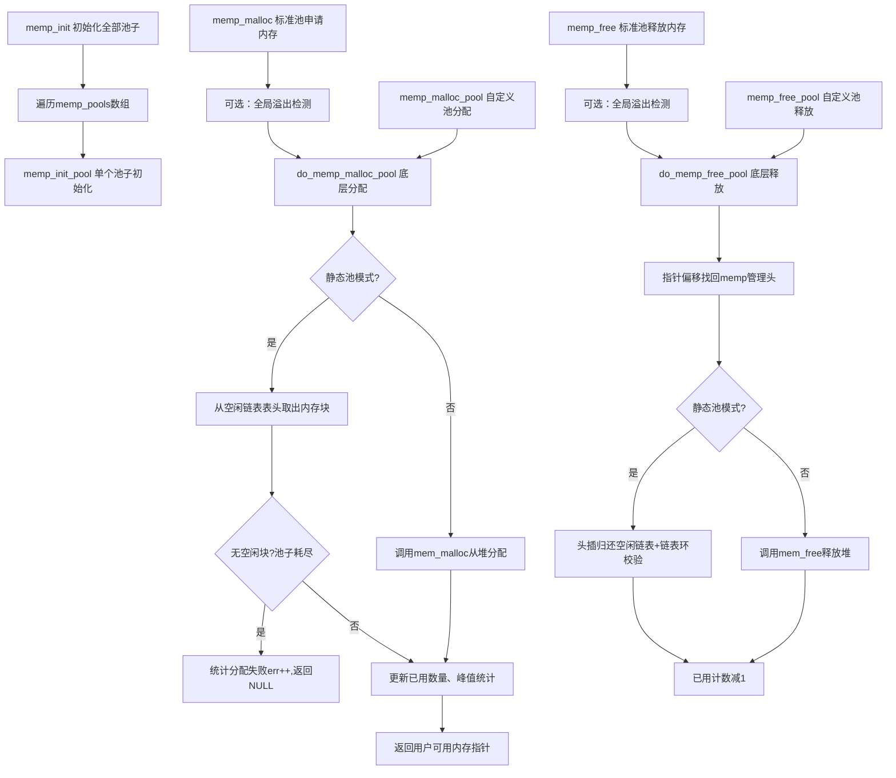
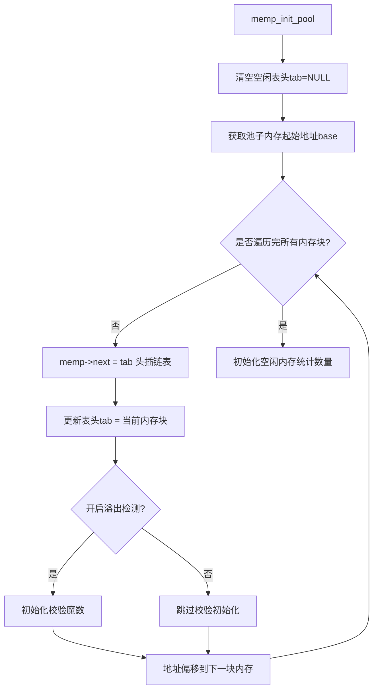
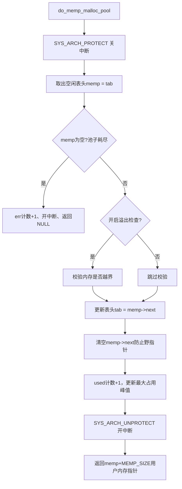
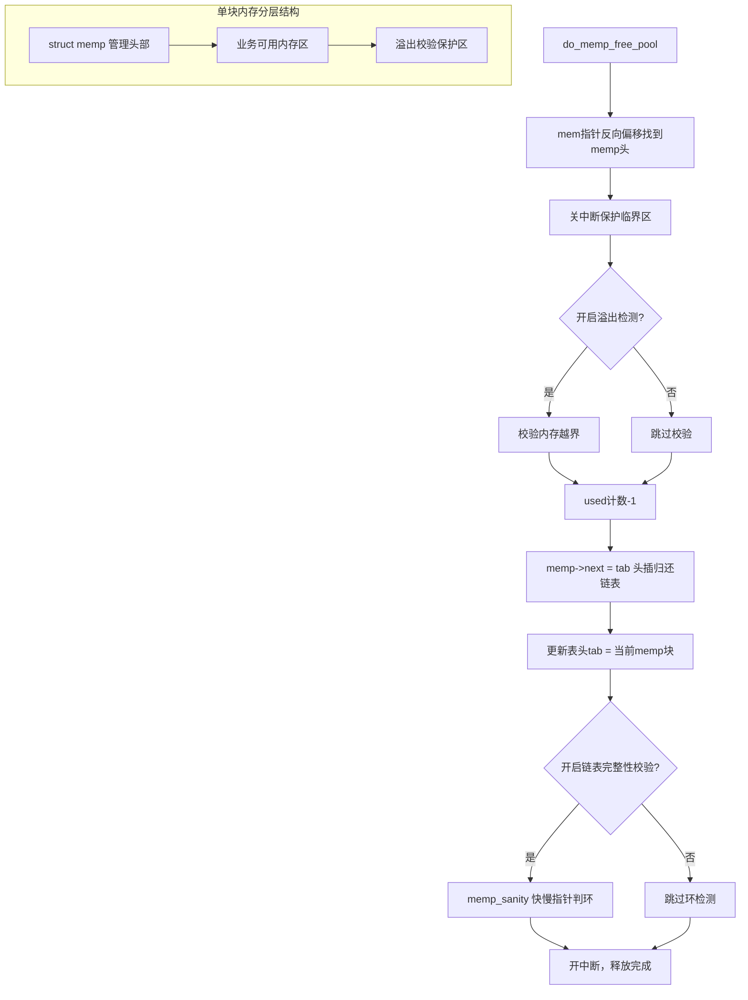
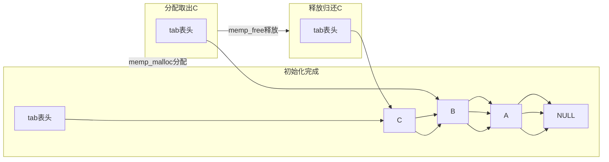

直接全选复制到VSCode新建 `memp完整图解.md`，安装插件 `Markdown Preview Mermaid Support` 右键侧边预览即可渲染。

```markdown
# lwIP memp.c 内存池零基础完整图解
前置操作（初学者必看）
1. VSCode左侧扩展商店，搜索安装插件：Markdown Preview Mermaid Support
2. 新建文件，后缀必须是 .md，例如 memp讲解.md
3. 将本文全部内容复制粘贴进去
4. 在文件内右键 → Open Preview to the Side，右侧自动生成流程图图片
5. 两个基础模式提前看懂（全文通用）
   ① 静态内存池（lwIP默认）：编译阶段就固定分配一整块连续内存，切割成小块用链表循环复用，不会产生内存碎片
   ② 动态内存池（MEMP_MEM_MALLOC=1开启）：不预分配整块内存，每次需要内存都调用系统堆分配，释放直接还给堆，不使用空闲链表
6. 基础名词解释
   内存块管理头(struct memp)：每一块可用内存最前面自带一段隐藏数据，存链表指针、调试信息，上层应用看不到也不能修改
   空闲链表表头tab：一个指针变量，记录当前第一个空闲内存块的地址，分配、释放全部只操作这个表头，速度极快
   头插法：新内存块直接放到链表最开头，只修改2个指针，不用遍历所有内存，时间复杂度O(1)
   临界区关中断：单片机随时会触发中断打断代码执行，操作链表时关掉中断，保证链表不会被中途篡改崩溃

# 图1：memp 整体函数调用总图
## 这张图作用（大白话）
整张图是memp.c文件的全局总路线图，把代码分成4条独立工作流程：
流程1：设备上电，一次性初始化lwIP所有内置内存池（TCP、UDP、数据包等池子）
流程2：业务代码需要一块内存时，调用对外接口分配内存
流程3：业务代码内存使用完毕，调用接口归还内存
流程4：开发者自定义全新内存池时使用的扩展接口
看懂这张图就能分清各个函数谁调用谁，理清整个文件执行逻辑。

## Mermaid渲染代码


## 逐框超详细零基础讲解
1. 代码第一行 flowchart TD
   TD含义：Top Down，图片从上到下纵向排列，符合普通人从上往下阅读习惯，新手更容易理解。
2. 最上方初始化流程（三框串联：memp_init → 遍历数组 → memp_init_pool）
   框A【memp_init 初始化全部池子】：设备上电自动运行的总初始化函数，负责把lwIP自带的所有内存池全部初始化一遍。
   连线A→B：执行完总初始化函数，进入循环逻辑。
   框B【遍历memp_pools数组】：memp_pools是全局数组，数组里保存TCP、UDP、数据包等每一种内存池的配置信息，循环逐个取出池子。
   连线B→C：每取出一个池子，单独调用初始化函数处理。
   框C【memp_init_pool 单个池子初始化】：针对某一个池子，切割内存、构建空闲单向链表。
3. 左侧中间分配内存流程（以框D mermp_malloc为入口）
   框D【memp_malloc 标准池申请内存】：给上层业务代码调用的对外开放接口，比如TCP协议需要内存存放连接信息，就调用这个函数申请。
   连线D→E：开启调试宏时，会执行全局溢出检测，遍历所有内存检查是否被越界篡改，正式产品可关闭节省性能。
   框E【可选：全局溢出检测】：调试功能，检测内存越界写bug。
   连线E→F：对外接口只是一层简单包装，真正分配内存的核心底层函数是框F。
   框F【do_memp_malloc_pool 底层分配】：分配内存全部核心逻辑写在这个函数内。
   连线F→G：分支判断，区分当前工程使用静态预分配内存池，还是动态堆内存池，两条执行路径完全分开。
   判断框G【静态池模式?】：对应代码宏 MEMP_MEM_MALLOC，宏为0走静态池路线，宏为1走动态堆路线。
   分支G --是--> 框H【从空闲链表表头取出内存块】：静态池提前切割好内存，存在空闲链表，直接拿链表第一个空闲块。
   分支G --否--> 框I【调用mem_malloc从堆分配】：动态模式没有预分配内存，直接调用系统堆分配函数新建一块内存。
   连线H→J：取出表头内存块后，先判断池子是否还有剩余空闲内存。
   判断框J【无空闲块?池子耗尽】：判断取出的表头指针是否等于NULL（空指针）。
   分支J --是--> 框K【统计分配失败err++,返回NULL】：池子所有内存都被占用，记录分配失败次数，返回空指针告诉上层申请内存失败。
   分支J --否--> 框L【更新已用数量、峰值统计】：成功拿到空闲内存，更新运行统计，记录当前占用块数、历史最高占用块数，用于排查内存泄漏。
   框I也会指向框L：动态堆模式分配成功后，同样更新内存统计。
   连线L→M：分配完成，把可用内存地址返回给上层业务代码。
   框M【返回用户可用内存指针】：跳过内存块最前面的struct memp管理头，只返回业务能读写的内存地址。
4. 左侧下方释放内存流程（以框N memp_free为入口）
   框N【memp_free 标准池释放内存】：上层代码内存使用完毕后，调用这个接口归还内存。
   连线N→O：和分配流程一致，开启调试宏时执行全局内存越界检测。
   框O【可选：全局溢出检测】：调试校验内存是否损坏。
   连线O→P：进入底层释放核心函数。
   框P【do_memp_free_pool 底层释放】：内存归还的全部核心逻辑。
   连线P→Q：上层只持有业务内存地址，底层需要向前偏移地址，找到隐藏的内存管理头struct memp。
   框Q【指针偏移找回memp管理头】：释放内存的关键步骤，没有管理头就无法操作空闲链表。
   连线Q→R：再次区分静态池、动态池两条路径。
   判断框R【静态池模式?】：再次判断内存池工作模式。
   分支R --是--> 框S【头插归还空闲链表+链表环校验】：静态池将内存块放回空闲链表表头，同时校验链表是否出现环形错误。
   分支R --否--> 框T【调用mem_free释放堆】：动态模式直接把内存还给系统堆，不进入空闲链表。
   框S、框T都会指向框U：内存占用计数减1，代表归还一块空闲内存。
   框U【已用计数减1】：更新内存占用统计。
5. 最底部自定义扩展接口（框V、框W）
   框V【memp_malloc_pool 自定义池分配】：开发者自己新建内存池时使用的分配接口，底层直接复用框F的分配逻辑，不用重复写代码。
   框W【memp_free_pool 自定义池释放】：自定义池子对应的释放接口，底层复用框P释放逻辑。

# 图2：静态内存池初始化流程
## 这张图作用（大白话）
只针对lwIP默认的静态内存池，详细讲解设备上电时，memp_init_pool函数完整工作步骤：
将一整块连续静态内存，均匀切割成多个大小完全相同的内存小块，通过头插法把所有小块串联成单向空闲链表，标记全部内存为空闲，等待后续分配使用。

## Mermaid渲染代码


## 逐框超详细零基础讲解
1. 代码第一行 flowchart TD：纵向从上到下布局，阅读直观。
2. 框A【memp_init_pool】：单个内存池初始化函数入口。
3. 连线A→B：初始化第一步，清空空闲链表表头指针。
   框B【清空空闲表头tab=NULL】：程序刚启动，链表内没有任何空闲内存块，表头赋值为空指针NULL。
4. 连线B→C：读取整块静态内存的起始地址。
   框C【获取池子内存起始地址base】：base变量保存这块大内存最开头的地址，所有切割操作从这个地址开始。
5. 连线C→D：进入循环判断，需要循环处理池子规定数量的所有内存块。
   判断框D【是否遍历完所有内存块?】：两种分支，没处理完走左侧循环流程，全部处理完成走下方收尾流程。
6. 分支D -- 否（还有未处理的内存块）
   连线D→E：执行头插链表核心逻辑。
   框E【memp->next = tab 头插链表】：当前这块内存的链表指针next，指向原来的空闲表头。
   连线E→F：更新表头指针。
   框F【更新表头tab = 当前内存块】：把当前处理的内存块设置为新的链表表头，实现头插，插入操作只修改两个指针，速度极快。
   连线F→G：判断是否开启内存越界检测功能。
   判断框G【开启溢出检测?】：对应代码宏 MEMP_OVERFLOW_CHECK，调试阶段开启，产品可关闭。
   分支G -- 是：开启检测，连线到框H。
   框H【初始化校验魔数】：在每一块内存尾部写入固定数字（魔数），后续分配释放时对比魔数，一旦魔数被修改，说明程序写内存越界，直接报错。
   分支G -- 否：关闭检测，连线到框I。
   框I【跳过校验初始化】：不填充魔数，节省运行时间。
   框H、框I共同指向框J：内存地址向后偏移一整块内存长度，定位到下一块待切割内存。
   框J【地址偏移到下一块内存】：地址向后跳一块内存总大小，处理下一个内存块。
   连线J→D：回到循环判断框D，继续处理下一块内存，循环往复直到所有块处理完毕。
7. 分支D -- 是（全部内存块处理完成）
   连线D→K：初始化内存统计数据。
   框K【初始化空闲内存统计数量】：记录池子总空闲块数，用于上层查看内存占用情况。

# 图3：静态池单次内存分配流程
## 这张图作用（大白话）
静态内存池模式下，上层每次申请一块内存时，底层完整执行的全部步骤。专门解决初学者两个核心疑问：
1. 分配内存操作为什么要关闭单片机中断？
2. 如何从空闲链表取出一块空闲内存，交给上层业务代码使用？

## Mermaid渲染代码


## 逐框超详细零基础讲解
1. 框A【do_memp_malloc_pool】：静态内存池分配内存的底层核心函数，所有分配逻辑全部写在此函数。
2. 连线A→B：第一步关闭系统中断，进入临界保护区。
   框B【SYS_ARCH_PROTECT 关中断】：单片机中断会随时抢占当前代码，如果修改链表一半被中断打断，链表指针会错乱、程序直接死机。关闭中断可以保证链表操作一次性完整执行，不会被打断。
3. 连线B→C：读取当前空闲链表表头。
   框C【取出空闲表头memp = tab】：tab保存链表第一个空闲内存块地址，赋值给临时变量memp。
4. 连线C→D：判断池子是否存在空闲内存。
   判断框D【memp为空?池子耗尽】：如果memp等于NULL空指针，代表池子所有内存都被占用。
   分支D -- 是（无空闲内存）：连线到框E。
   框E【err计数+1、开中断、返回NULL】：记录分配失败次数，打开中断恢复系统正常运行，返回空指针告知上层内存申请失败。
   分支D -- 否（存在空闲内存）：连线到判断框F。
5. 判断框F【开启溢出检查?】：判断是否开启内存越界调试检测。
   分支F -- 是：连线框G。
   框G【校验内存是否越界】：读取内存尾部魔数，对比初始化时写入的固定值，如果不一致说明内存被越界篡改，程序断言报错。
   分支F -- 否：连线框H。
   框H【跳过校验】：不执行内存校验，节省运行性能。
6. 框G、框H都指向框I：执行链表弹出操作。
   框I【更新表头tab = memp->next】：原本表头的内存块被上层拿走使用，表头需要更新为下一块空闲内存。
7. 连线I→J：清空已分配内存块的链表指针。
   框J【清空memp->next防止野指针】：这块内存已经离开空闲链表，残留的next指针会产生野指针，清空后方便调试排查错误。
8. 连线J→K：更新内存占用统计。
   框K【used计数+1，更新最大占用峰值】：已使用内存块数量+1，同时记录程序运行以来内存最高占用值，用来排查内存泄漏问题。
9. 连线K→L：链表操作全部完成，打开中断。
   框L【SYS_ARCH_UNPROTECT 开中断】：退出临界区，允许单片机中断正常抢占CPU。
10. 连线L→M：返回可用内存地址给上层代码。
    框M【返回memp+MEMP_SIZE用户内存指针】：重点难点！每块内存最前面是struct memp管理头，占用MEMP_SIZE字节，这段区域上层不能操作。因此地址向后偏移MEMP_SIZE字节，只把业务可读可写的内存地址返回给上层。

# 图4：静态池释放流程 + 内存块物理布局
## 这张图作用（大白话）
整张图分为上下两部分：
上方子图：画出单块内存真实三层物理存储结构，让初学者直观看到管理头、业务内存、校验区的排布；
下方流程：讲解内存使用完毕后，完整归还到空闲链表的步骤。
解决新手最大难点：上层代码只持有业务内存地址，底层如何反向找到前面隐藏的struct memp管理头。

## Mermaid渲染代码


## 逐框超详细零基础讲解
## 第一部分：上方子图「单块内存分层结构」
子图内三个框代表一块内存连续排列的三段区域，物理地址顺序：先X，再Y，最后Z。
框X【struct memp 管理头部】：固定长度MEMP_SIZE，存放链表next指针、调试文件行号，上层代码禁止读写这段内存，只由底层memp管理。
框Y【业务可用内存区】：上层分配内存后，正常读写操作的区域，函数返回给用户的指针就指向这段内存起始地址。
框Z【溢出校验保护区】：内存尾部预留区域，存放固定魔数，检测程序写内存越界覆盖到相邻内存块。

## 第二部分：下方内存释放主流程逐框讲解
1. 框A【do_memp_free_pool】：静态池内存释放底层核心函数入口。
2. 连线A→B：释放第一步，反向寻址内存管理头。
   框B【mem指针反向偏移找到memp头】：核心难点！上层free函数传入的指针只指向框Y业务内存区，不知道前面还有框X管理头。将指针地址向前减去MEMP_SIZE，就能算出struct memp头部地址，没有头部无法操作空闲链表归还内存。
3. 连线B→C：关闭中断保护临界区。
   框C【关中断保护临界区】：和分配逻辑一致，修改空闲链表时关闭中断，防止链表被中途篡改损坏。
4. 连线C→D：判断是否开启内存越界检测。
   判断框D【开启溢出检测?】：调试宏开关。
   分支D -- 是：连线框E。
   框E【校验内存越界】：释放前读取尾部魔数，校验内存是否被写坏。
   分支D -- 否：连线框F。
   框F【跳过校验】：不执行内存校验。
5. 框E、框F共同指向框G：更新内存占用统计。
   框G【used计数-1】：归还一块内存，已使用块数减1。
6. 连线G→H：头插归还链表第一步。
   框H【memp->next = tab 头插归还链表】：当前要释放的内存块next指针，指向现在的空闲链表表头。
7. 连线H→I：更新空闲表头。
   框I【更新表头tab = 当前memp块】：把当前释放的内存块设置为新的链表表头，完成头插回收。
8. 连线I→J：判断是否开启链表完整性校验。
   判断框J【开启链表完整性校验?】：对应宏 MEMP_SANITY_CHECK，用于检测重复释放内存导致的环形链表bug。
   分支J -- 是：连线框K。
   框K【memp_sanity 快慢指针判环】：弗洛伊德快慢指针算法，慢指针一次走1步，快指针一次走2步，如果快慢指针相遇，说明链表存在环形，代表重复释放同一块内存，程序卡死，直接断言报错。
   分支J -- 否：连线框L。
   框L【跳过环检测】：关闭链表校验，节省运行性能。
9. 框K、框L共同指向框M：释放流程全部结束，打开中断。
   框M【开中断，释放完成】：退出临界区，中断恢复正常运行，释放函数执行完毕。

# 图5：空闲链表状态时序变化
## 这张图作用（大白话）
横向对比时序图，只用三个运行状态，直观展示头插法对空闲链表顺序的改变，解决初学者最大疑惑：
内存物理存储顺序是A、B、C三块，为什么分配永远取出C，释放后C又回到链表最前面。

## Mermaid渲染代码


## 逐段超详细零基础讲解
1. 代码第一行 flowchart LR
   LR含义：Left Right，图片横向从左到右排布，方便并排对比程序三个运行时刻的链表状态。
2. 第一块子图「初始化完成」（设备上电初始化结束后的链表状态）
   T1代表空闲链表表头tab变量，T1箭头指向内存块C；
   内存块C的next指针指向内存块B；
   内存块B的next指针指向内存块A；
   内存块A指向NULL空指针，NULL代表链表末尾，没有更多空闲内存。
   重点区分：物理内存真实排布顺序 A→B→C，但是初始化头插法后，逻辑空闲链表顺序 C→B→A。
3. 第一条时序连线：初始化完成 -- memp_malloc分配 --> 分配取出C
   调用分配函数memp_malloc，取出链表表头C，表头更新为B，内存块C交给上层业务代码占用。
4. 第二块子图「分配取出C」（内存C被占用后的链表状态）
   T2是更新后的表头tab，T2指向内存块B；
   B指向A，A指向NULL；
   当前仅剩余B、A两块空闲内存。
5. 第二条时序连线：分配取出C -- memp_free释放 --> 释放归还C
   上层用完内存C，调用释放函数memp_free归还，采用头插法，直接把C放到链表最开头。
6. 第三块子图「释放归还C」（内存C归还完成）
   T3是更新后的表头tab，T3重新指向内存块C；
   C指向B，B指向A，A指向NULL；
   链表恢复初始化完成时的完整状态，等待下一次分配调用。
7. 初学者总结固定规律
   ① 分配内存：永远取链表最开头的内存块；
   ② 释放内存：永远把归还的内存放到链表最开头；
   ③ 全程只修改表头tab指针，不需要遍历全部内存块，运行速度极快。
```