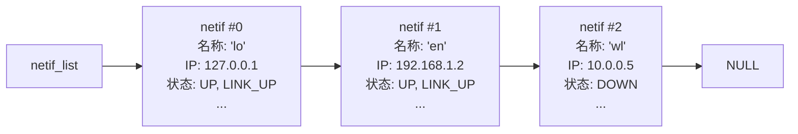
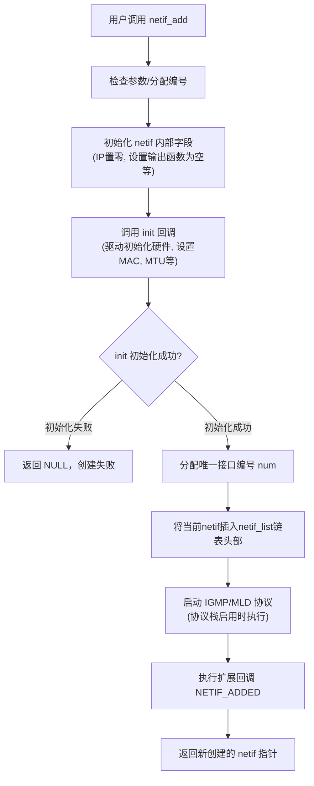
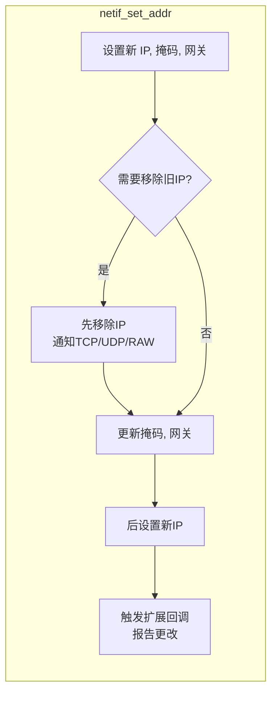
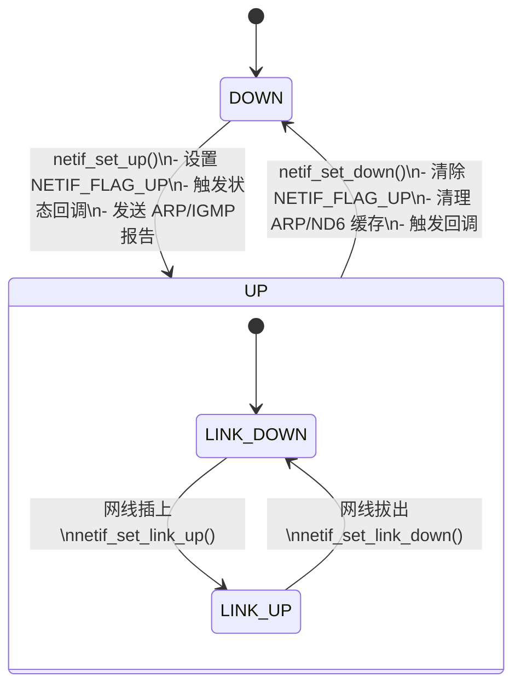
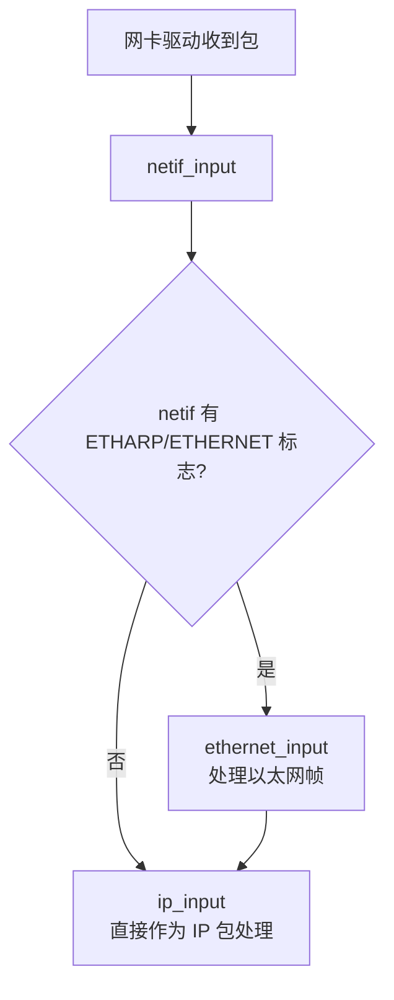
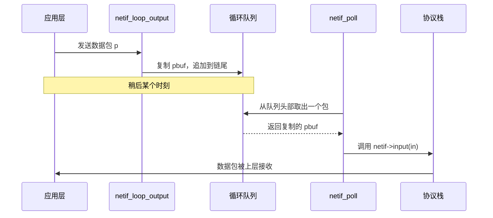
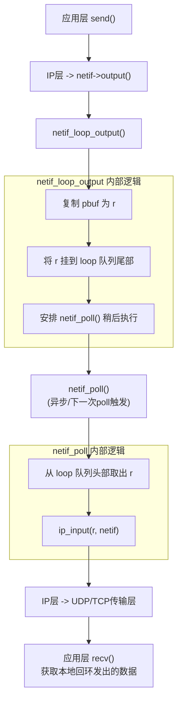
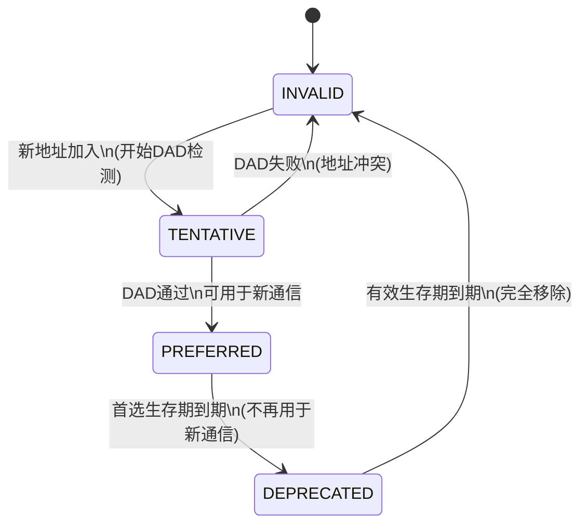

这个 `netif.c` 是 lwIP 协议栈里的 **“网络接口管理员”**。它负责管理网卡（有线、无线、虚拟环回等），让你可以添加网卡、配置 IP 地址、设置上线或下线状态，并处理数据包的收发流程。对于初学者来说，理解它的核心机制比通读代码更重要。下面我们用图解的方式拆解这个文件。

---

### 1. 网络接口的核心：`struct netif` 链表

lwIP 中所有网卡通过**单向链表**连接，全局变量 `netif_list` 指向第一个网卡。每个 `netif` 结构体记录了网卡的属性、回调函数和状态。



每个 `netif` 里的关键“抽屉”：
- **IP 地址（IPv4/IPv6）**：记录自己的 IP、子网掩码、网关。
- **回调函数**：`output`（发送 IPv4 包）、`output_ip6`（发送 IPv6 包）、`input`（接收包入口）、状态变化回调等。
- **状态标记**：`flags` 记录是否启用（`NETIF_FLAG_UP`）、链路是否接通（`NETIF_FLAG_LINK_UP`）等。
- **驱动程序私有数据**：`state` 指向网卡硬件相关的结构体。
- **回环队列**：`loop_first` / `loop_last` 用于自己发给自己的数据包。

---

### 2. 添加一个网卡：`netif_add` 流程图




**重点**：
- 每个网卡会得到一个从 0 开始递增的编号（`num`），用于生成类似 `en0`, `lo0` 的名称。
- 驱动程序的 `init` 函数被调用后，网卡才算真正准备就绪。

---

### 3. 配置 IPv4 地址三部曲：IP、掩码、网关

`netif_set_addr` 一次性设置 IP、掩码、网关。内部三个函数分别检查是否真的发生了变化，然后再做处理。



**关键影响**：
- IP 改变时会通知 TCP/UDP/RAW 层，它们可以重置连接。
- 如果开启了 `LWIP_ACD`（地址冲突检测），会启动相应的检测流程。
- SNMP 统计信息（`mib2_*`）会同步更新。

---

### 4. 启动与停止网卡：UP / DOWN

`netif_set_up` 和 `netif_set_down` 决定了协议栈是否通过该网卡收发数据。



**注意**：
1. `UP` 是软件管理状态，`LINK_UP` 是物理链路状态。只有两者都为真时，才会真正发送数据包。


---

### 5. 数据包的输入：`netif_input`

驱动收到数据包后，调用 `netif_input(pbuf, netif)`，它会根据网卡标志决定交给谁处理：



`ethernet_input` 会解析以太网头，然后将内部 IP 包继续传递给 `ip_input`。
**注意**：
1. 标志的含义
| 标志 | 含义 | 典型用途 |
|------|------|----------|
| `NETIF_FLAG_ETHARP` | **支持 ARP 协议** | 用于 IPv4 地址 → MAC 地址的解析，网卡驱动需实现 ARP 请求/应答。 |
| `NETIF_FLAG_ETHERNET` | **链路层是以太网** | 表示数据帧需要标准的以太网头部（目标MAC、源MAC、类型字段）。 |


---

### 6. 环回接口：自己发给自己

环回功能允许设备内部发送数据包到自己。典型场景是 `127.0.0.1`（IPv4）或 `::1`（IPv6）。它的实现很巧妙：


**注意**：
1. 第一步：上层协议栈触发发送
2. 第二步：netif_loop_output 复制数据包
3. 第三步：将副本挂入环回队列
4. 第四步：安排 netif_poll 去处理队列
5. 第五步：netif_poll 从队列取出并注入协议栈
5. 第六步：数据包在协议栈中“上行”

可视化顺序图：

**关键点**：
- `netif_loop_output` 负责将包**复制**后放入队列。
- `netif_poll` 负责从队列取出包并送入协议栈。
- 如果支持多线程 (`LWIP_NETIF_LOOPBACK_MULTITHREADING`)，`netif_loop_output` 会通过 `tcpip_try_callback` 在 TCPIP 线程中安排 `netif_poll` 的调用，避免并发问题。

---

### 7. IPv6 地址生命周期管理

IPv6 地址比 IPv4 复杂，需要明确状态（无效、临时、首选、弃用）。`netif_ip6_addr_set_state` 负责状态切换。



同时，文件提供了 `netif_add_ip6_address` 帮助添加新地址，它会自动找一个空余的地址槽位，并设置为 TENTATIVE 状态。

---

### 8. 回调与事件通知

为了上层应用能感知网络状态变化，`netif.c` 提供了两类回调：

- **直接回调**：`status_callback`（接口 up/down 或地址变化）、`link_callback`（链路 up/down）。
- **扩展回调**：以链表形式管理多个监听者 (`netif_ext_callback_t`)，可以同时通知多个模块。通过 `netif_invoke_ext_callback` 广播事件，例如 `LWIP_NSC_NETIF_ADDED`、`LWIP_NSC_IPV4_ADDRESS_CHANGED` 等。

```
 netif 发生事件
      ↓
 netif_invoke_ext_callback()
      ↓
 遍历 ext_callback 链表
      ↓
 [callback #0] → [callback #1] → [callback #2]
   DHCP模块         SNMP代理        用户自定义
```

这种设计让状态变化能自动扩散到 DHCP、AUTOIP、SNMP 等模块，解耦了核心接口管理与高层应用。

---

### 总结：一张图看清 `netif.c` 的职责

```
+------------------------------------------------------------------+
|                        lwIP netif.c                              |
|  - 管理 netif 链表 (添加/删除/查找)                              |
|  - 配置 IPv4/IPv6 地址、掩码、网关                               |
|  - 控制接口 UP/DOWN 及 LINK 状态                                 |
|  - 提供数据包入口: netif_input (ethernet -> ip)                  |
|  - 实现环回接口: netif_loop_output / netif_poll                  |
|  - 回调机制: 状态变化时通知上层应用/SNMP/DHCP等                  |
+------------------------------------------------------------------+
        |          |           |
  驱动层 <--调用   |   调用 --> 协议栈 (ip_input/tcp_input)
                   |
             应用层 (状态通知)
```


掌握这些核心流程，你就已经理解了 `netif.c` 的精髓，剩下的代码细节都是为这些流程服务的。