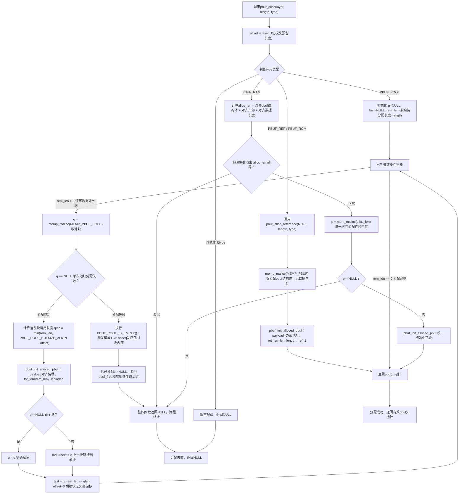
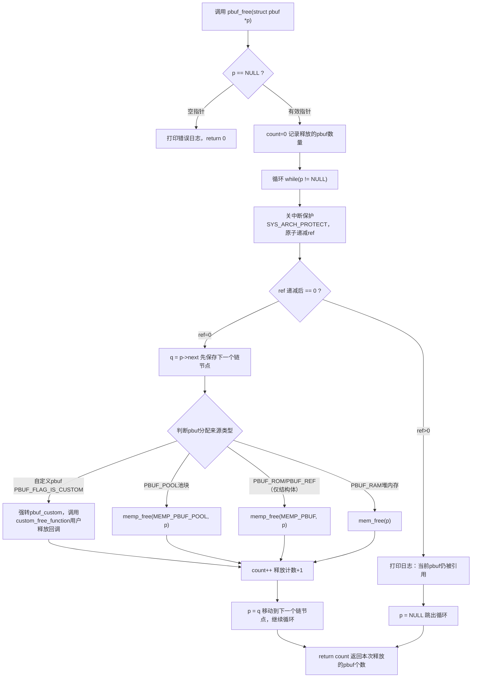
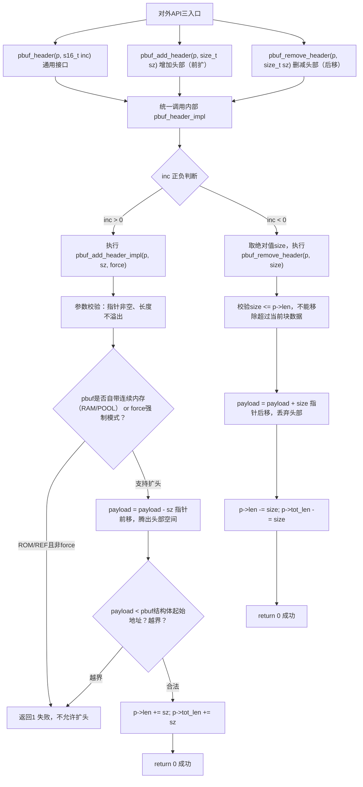
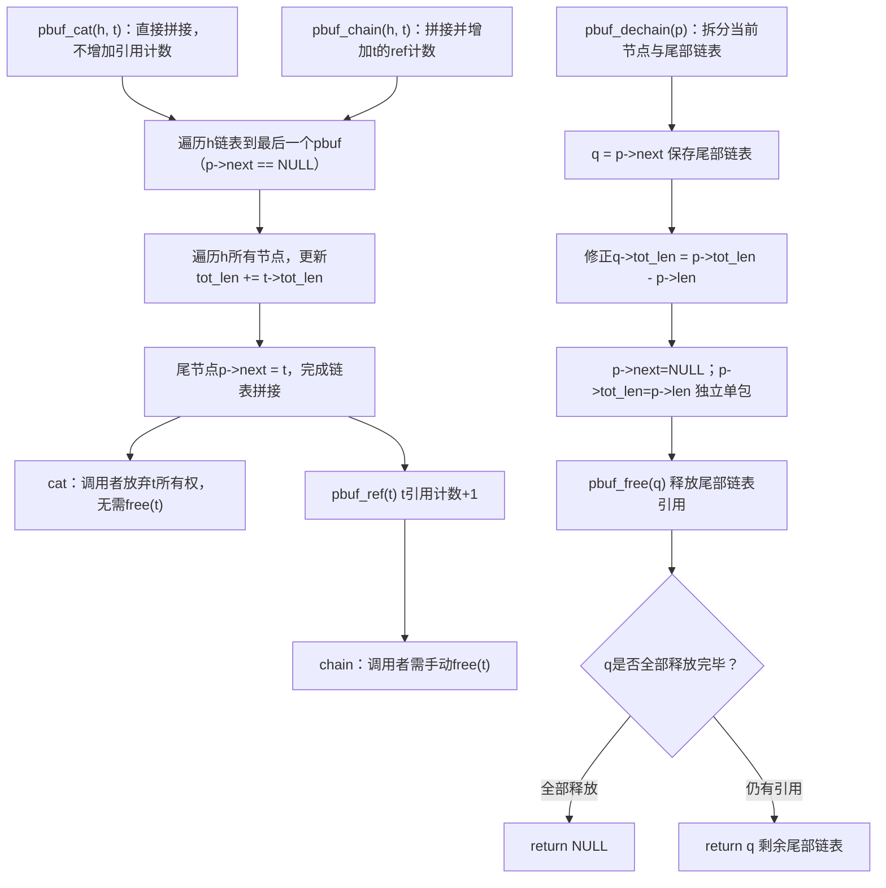
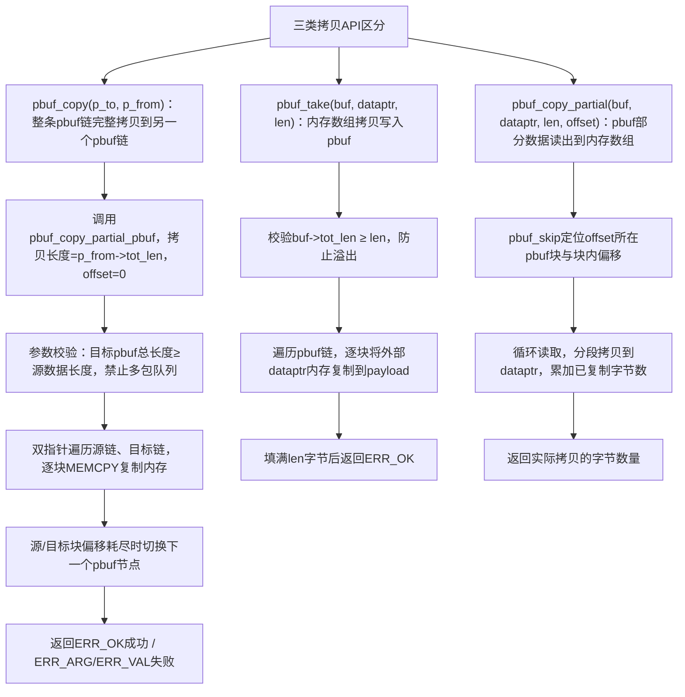
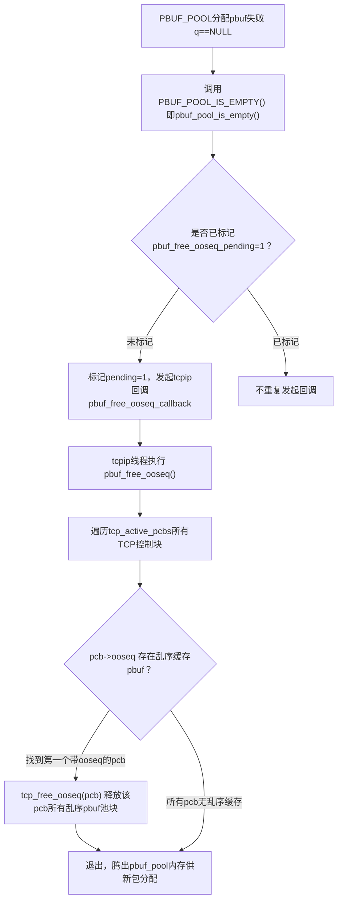

# pbuf 完整讲解（lwIP 数据包缓冲区）
## 一、pbuf 全称与本质
**pbuf = packet buffer，数据包缓冲区**
是 lwIP 协议栈**唯一用来存放网络收发数据的结构体**，相当于嵌入式网络的“数据包容器”。
嵌入式内存资源紧张、网卡收发频繁，不能直接用数组/大块 malloc，所以专门设计了 pbuf 一套内存管理模型。

## 二、核心设计目标
1. 支持**分片存储**：一个大包拆成多段内存，用链表串起来（pbuf 链），避免一次性申请超大连续内存；
2. 支持**零拷贝**：可以直接指向网卡缓冲区、ROM 常量数据，不用复制数据；
3. 高速分配：提供固定大小内存池，网卡中断收包时快速拿缓冲，减少卡顿；
4. 统一接口：网卡驱动、IP、TCP、UDP 全部共用 pbuf，上下层不用转换数据格式。

## 三、pbuf 结构体关键字段（对应上文注释）
```c
struct pbuf {
  void *payload;    // 数据缓冲区起始指针（可前后移动增减协议头）
  u16_t len;         // 当前pbuf有效数据长度
  u16_t tot_len;     // 本pbuf+后续所有pbuf总数据长度
  struct pbuf *next; // 链表下一块pbuf
  LWIP_PBUF_REF_T ref; // 引用计数，多模块共用pbuf靠它安全释放
  u8_t type_internal; // pbuf类型RAM/POOL/ROM/REF
};
```
### 两个最容易混淆的长度
1. `len`：当前这块缓冲区的数据大小；
2. `tot_len`：当前 + 后面所有分片的总字节；
> 判断**单个数据包结束**的标准：`p->tot_len == p->len`，此时这个pbuf就是该包最后一块分片。

## 四、两个核心概念（对应你原文注释）
### 1. pbuf chain（pbuf 链）
**一条链 = 1 个完整数据包**
大包放不下一块pbuf时，拆成多个pbuf，`next` 连成链表。
例：1500字节以太网帧，内存碎片不足，拆3块pbuf组成一条链，代表同一帧数据。

遍历单包终止条件：`p->tot_len == p->len`，不是 `next == NULL`。

### 2. packet queue（数据包队列）
**多条链拼在一起 = 多个独立数据包排队**
一条链是一个包，多个链首尾相连就是待发送/待接收的包队列。
lwIP原生不直接支持队列管理，需要自己封装链表头来存多条pbuf链。

## 五、pbuf 的4种内存类型（PBUF_RAM / PBUF_POOL / PBUF_ROM / PBUF_REF）
1. **PBUF_RAM**
动态堆内存，协议栈组装报文（TCP发送缓存）常用，数据和pbuf头部连续分配。
2. **PBUF_POOL**
内存池固定小块，网卡接收专用，中断里分配速度极快，收包首选。
3. **PBUF_ROM**
数据放在只读Flash/ROM，只引用不拷贝，用于静态常量网页、常量报文。
4. **PBUF_REF**
数据在外置RAM（网卡DMA缓冲区、外部缓存），零拷贝，无需复制数据。

## 六、工作流程举例
### 接收流程
网卡收到数据 → 从内存池快速分配 PBUF_POOL 类型pbuf → 数据存入payload → 多分片组成pbuf链 → 上交IP层解析。

### 发送流程
应用层数据 → 分配PBUF_RAM组装TCP头/IP头 → 形成pbuf链 → 网卡驱动顺着链表分段发送。

## 七、一句话总结
pbuf 是 lwIP 为嵌入式设备量身设计的**通用数据包存储单元**，靠链表分片、多种内存模式、内存池加速，解决嵌入式内存碎片化、收发效率低、数据拷贝开销大的问题，是整个lwIP网络数据流转的基础载体。


# lwIP pbuf.c 完整流程图+逐行源码对齐解析
先梳理源码核心约束（严格对照你提供的pbuf.c）：
1. pbuf 两个核心概念：**pbuf链（单个数据包分片）**、**packet queue（多数据包，源码说明当前不支持）**；区分规则：链尾pbuf `p->tot_len == p->len`，若还有`next`则是多包队列；
2. 4种pbuf类型：`PBUF_RAM/PBUF_POOL/PBUF_ROM/PBUF_REF`，外加自定义`PBUF_FLAG_IS_CUSTOM`；
3. 引用计数`ref`：初始分配=1，`pbuf_ref()`+1，`pbuf_free()`递减，0才释放；
4. 池耗尽逻辑：`PBUF_POOL`分配失败时调用`PBUF_POOL_IS_EMPTY()`，尝试释放TCP乱序段ooseq回收内存；
5. 头部操作区分强制/非强制：`pbuf_add_header`禁止ROM/REF扩头，`pbuf_add_header_force`允许；
6. 链拼接：`pbuf_cat`不增加引用、`pbuf_chain`会ref计数+1；`pbuf_dechain`拆分并释放尾部引用；
7. 内存释放区分：MEMP_PBUF_POOL、MEMP_PBUF、堆mem_malloc、自定义free回调。

下面分6张Mermaid流程图，每张严格匹配源码逻辑，附带逐段源码对照详解。

## 图1：pbuf_alloc 完整分配流程（源码320~430行）



### 详细解释（对齐源码）
1. **入口参数**
   - layer：协议层偏移（ETH/IP/TCP预留头部空间）；
   - length：数据包总数据长度；
   - type：4种分配模式，核心差异是内存来源。
2. **PBUF_ROM/PBUF_REF（轻量引用）**
   仅分配`struct pbuf`头部结构体，数据区使用外部已有内存；ROM代表只读常量内存，REF代表临时单线程动态内存，不允许直接扩头部（无预留内存）。
3. **PBUF_POOL（接收包标准方案）**
   固定大小内存池，大包会拆成多条pbuf链表；分配失败时触发`pbuf_pool_is_empty()`，通过tcpip回调释放TCP乱序缓存段（ooseq）腾出池内存；每一块分配完成后offset置0，只有第一个块预留协议头。
4. **PBUF_RAM（连续堆内存）**
   结构体、协议头、数据区在同一块连续堆内存，适合DMA硬件；源码做溢出校验防止长度计算溢出导致内存越界。
5. 统一初始化函数`pbuf_init_alloced_pbuf`：所有类型统一设置`next=NULL、ref=1、payload、len、tot_len`。
6. ref 代表 引用计数（reference count）
7. 既然前面已经排除了 `p == NULL` 的情况，为什么后面还要再写一句 `while(p != NULL)`？这不是重复判断吗？
 答：其实**这两个判断的职责完全不同**，而且 `while(p != NULL)` 这个循环条件**绝对不能省**。我们拆开来看：
#### （1）. 开头 `if (p == NULL)` 的作用：**输入参数校验**
这是**调用者传入参数的直接检查**，只执行一次。  
如果调用者不小心传了个空指针，函数马上打印错误并返回 0，避免后续对 NULL 解引用导致崩溃。
它是保护函数**入口安全**的一道门。

---

 #### （2）. 循环 `while(p != NULL)` 的作用：**遍历整个 pbuf 链表**
这里的 `p` 在循环过程中**会变化**。即使进入循环前 `p` 不为 NULL，循环体里会执行：
```c
p = q;   // q = p->next
```
当处理到链表最后一个节点时，`q` 是 NULL，下一次循环判断 `while(p != NULL)` 就会自然退出。

还有更关键的一种情况：**遇到 ref>0 的节点**，代码直接执行：
```c
p = NULL;   // 强制跳出循环
```
这时也要靠 `while(p != NULL)` 来退出。

所以这个 `while` 是**遍历链表的循环控制**，不是对原始参数的二次验证。

---

 #### （3）. 用一个简化的执行过程来对比

假设传入链表：`a → b → c → NULL`，且所有节点 ref 都可释放。

- **入口检查**：`p` 指向 `a`，不为 NULL，通过。
- **第一次循环**：处理 `a`，然后 `p = b`（循环末尾），`b != NULL`，继续。
- **第二次循环**：处理 `b`，然后 `p = c`，继续。
- **第三次循环**：处理 `c`，然后 `p = NULL`，下一次循环条件不成立，退出。

如果去掉 `while`，只靠开头的 `if`，整个函数只能处理一个节点，无法释放整条链。

---

8. 关中断的作用：这个保护机制让 ref 的递减操作在多任务并发时不会被打断，保证引用计数的正确性，是 pbuf 安全共享与自动回收的基础。


## 图2：pbuf_free 释放逻辑（源码700~780行，引用计数核心）

### 详细解释（对齐源码）
1. **引用计数原子保护**
   ref递减必须关中断，多线程下防止并发修改导致计数错乱；每个pbuf创建时`ref=1`，每多一处持有指针调用`pbuf_ref(p)`计数+1。
2. **链式释放规则（源码关键注释案例）**
   释放从链表头部开始，**连续释放所有ref=0的节点**；一旦遇到ref>0的节点，立刻停止，后面整条链表保留不释放。
   例：链 a(ref=1)→b(ref=2)→c(ref=1)，调用pbuf_free(a)：a计数变0释放，b计数变为1>0，停止释放，仅释放a。
3. **四种释放路径区分**
   - PBUF_POOL：归还内存池；
   - PBUF_ROM/REF：仅释放pbuf结构体，外部数据内存不归pbuf管理；
   - PBUF_RAM：释放整块堆内存；
   - 自定义pbuf：执行用户注册的释放回调，用于零拷贝硬件缓存。
4. 返回值：本次调用真正释放了多少个pbuf节点，上层可用于内存统计。

## 图3：pbuf_header / add_header / remove_header 头部偏移操作（源码480~585行）

下面基于你给的流程图和解释，把 `pbuf_header` 这套“零拷贝头部偏移”机制做个完整拆解。核心思想贯穿在 **指针移动代替数据拷贝**、**内存类型约束**、**长度同步** 这三点里。

---

### 一、为什么需要这套机制 —— 协议栈的层层剥皮与层层包装

网络数据包从应用层往下发，每过一层都要在前面加一个头部：

```
[应用数据]
→ [TCP头][应用数据]           （传输层加头）
→ [IP头][TCP头][应用数据]      （网络层加头）
→ [以太网头][IP头][TCP头][应用数据] （链路层加头）
```

收包方向完全相反，每一层处理完自己的头部就把它“剥掉”：

```
[以太网头][IP头][TCP头][应用数据]
→ 去掉以太网头 → [IP头][TCP头][应用数据]
→ 去掉IP头     → [TCP头][应用数据]
→ 去掉TCP头    → [应用数据]
```

如果每次加头/去头都要把数据 `memmove` 一遍，性能会非常差。  
pbuf_header 的设计就是**只动指针，不动数据**。

---

### 二、三个对外 API 的关系

流程图顶部有三个入口：

| API | 行为 | 含义 |
|-----|------|------|
| `pbuf_header(p, inc)` | 通用接口，`inc` 可正可负 | 正数 = 前扩头部；负数 = 后移剥离头部 |
| `pbuf_add_header(p, sz)` | 内部调用 `pbuf_header(p, sz)` | 增加头部 |
| `pbuf_remove_header(p, sz)` | 内部调用 `pbuf_header(p, -sz)` | 删除头部 |

它们最终都汇集到内部的 `pbuf_header_impl`（或宏等效的 `pbuf_header` 实现函数），这个函数再根据正负号分发到 **前扩** 或 **后移** 两个分支。

---

### 三、inc > 0：向前扩展头部（发包方向）

这是发包时最常用的操作。要往 payload 前面插入一个协议头，但不拷贝任何数据。

**流程对应：**

1. **参数校验**  
   - `p != NULL`
   - 扩展后的 `len` 不能溢出（`u16_t` 范围）

2. **检查是否允许前移 payload 指针**  
   `ROM / REF` 类型的 pbuf 通常不允许，因为：
   - `PBUF_ROM`：payload 指向只读数据区，前面没有可写的合法内存；
   - `PBUF_REF`：payload 指向外部引用内存，往前写会踩到未知区域。  
   除非是 `force=1` 的强制模式（仅内部接收链路使用，且调用者保证内存安全）。

3. **指针前移**
   ```c
   p->payload = (u8_t *)p->payload - sz;
   ```
   这就是“零拷贝”的核心：数据本身完全没动，只是把 `payload` 指针往低地址方向移动 `sz` 字节，让出新头部空间。

4. **越界检查**  
   新 `payload` 指针必须 **≥ pbuf 结构体内部数据的起始地址**。  
   对于 `PBUF_RAM`，起始地址是 `(u8_t *)p + sizeof(struct pbuf) + 预偏移量`；  
   对于 `PBUF_POOL`，起始地址是该内存池块的数据区首地址。  
   如果指针越过这个边界，就踩到了 pbuf 结构体本身，返回失败。

5. **长度更新**  
   ```c
   p->len += sz;     // 当前节点长度增加
   p->tot_len += sz; // 整条链总长度增加
   ```
   这两个必须**同步更新**，否则后续 `pbuf_free` 或任何依赖 `tot_len` 的逻辑都会出错。

成功后，调用者可以直接向 `p->payload` 开始的 `sz` 字节写入新头部（如 IP 头）。

---

### 四、inc < 0：向后移删除头部（收包方向）

这是收包时“剥掉头部”的操作。例如 TCP 层收到数据后，把 TCP 头去掉，只留下应用数据。

**流程对应：**

1. **检查要移除的大小不能超过当前节点长度**
   ```c
   if (size > p->len) return -1;
   ```
   不能跨节点移除，只操作第一个 pbuf 节点的头部区域。

2. **指针后移**
   ```c
   p->payload = (u8_t *)p->payload + size;
   ```
   payload 指针跳过被删除的头部，直接指向有效负载开始的地方。

3. **长度更新**
   ```c
   p->len -= size;
   p->tot_len -= size;
   ```

操作完成后，上层协议看到的 payload 就已经是去掉外层头部后的数据，同样**零拷贝**。

---

### 五、force 强制模式的区别

根据流程图，判断的关键分支是：

> "pbuf是否自带连续内存（RAM/POOL） or force强制模式？"

- 普通调用（`pbuf_add_header` / `pbuf_header` 非负 inc）：  
  `force=0`，**ROM / REF 类型直接拒绝**，返回失败。  
  因为让这些类型的 payload 向前扩展意味着要往外部内存/只读区前面写数据，不安全。

- 强制调用（`pbuf_add_header_force`，内部静态函数或通过 API 调用）：  
  `force=1`，**即使是 ROM / REF 也允许指针前移**。  
  这主要用于接收链路的特定场景：例如网卡驱动收到的数据包本身就是 `PBUF_ROM` 类型，但驱动和协议栈之间有约定，payload 前面其实已经有预留给链路层的空间。这时可以强制往前扩，不破坏安全性。

---

### 六、len 和 tot_len 同步的重要性

- `p->len`：**当前这个 pbuf 节点**中有效数据的长度；
- `p->tot_len`：**从当前节点开始，整条链**的总有效数据长度。

任何一次 `pbuf_header` 操作，**这两个都必须同增或同减**。  
否则在遍历链表、校验数据、计算校验和、或者 `pbuf_free` 回收时，长度信息不一致会导致：
- 数据包总长计算错误；
- 校验和只覆盖部分数据；
- 释放时释放长度与实际长度不匹配，造成内存泄漏或越界。

---

### 七、边界保护 —— 防止 payload 指针踩进结构体

当 `pbuf_add_header` 把 payload 指针往前移动时，必须确保它不会越界到比 pbuf 结构体内存起始地址还小的位置。

对于 `PBUF_RAM`：结构体和 payload 在同一块堆内存里，`payload` 的起始位置紧挨结构体后头（或者预留给 headroom 的偏移后）。  
越界会导致指针指向结构体内部的 `ref`、`len` 等字段区，后续写入头部会破坏这些关键字段，直接导致协议栈崩溃。

对于 `PBUF_POOL`：逻辑相同，只不过内存来自池块，池块有固定的数据区起始地址。

---

**总结一句话**：  
这套机制完全不移动数据，只通过调整 `payload` 指针和同步更新 `len`/`tot_len`，在发包时“凭空”腾出头部空间，在收包时“虚拟”地剥掉外层头部，实现了高性能的协议头零拷贝封装与解封装。而 `force` 模式和越界检查则在不同内存类型下保证了安全性。


注意:
1. inc 是 pbuf_header(struct pbuf *p, s16_t inc) 中的第二个参数，全称 increment，表示对头部空间的“增量”，是一个带符号的 16 位整数。



### 详细解释（对齐源码）
1. **核心设计：零拷贝调整协议头**
   不移动任何数据，只修改`payload`指针地址，用于TCP/IP多层封装：
   - 发包：先分配带偏移的pbuf，再`pbuf_add_header`往前腾空间填充IP、以太网头；
   - 收包：解析完一层头后`pbuf_remove_header`跳过头部，直接处理上层数据。
2. **force强制模式区别**
   - `pbuf_add_header`：force=0，PBUF_ROM/PBUF_REF禁止前移payload（外部内存不可控）；
   - `pbuf_add_header_force`：force=1，接收链路内部专用，允许ROM/REF扩头。
3. 长度同步规则：`len`（当前单块有效长度）、`tot_len`（整条链总长度）必须同步增减，否则数据包长度计算错乱。
4. 边界保护：前移payload不能越过pbuf结构体内存起始位置，防止访问结构体内部字段。


## 图4：pbuf_cat / pbuf_chain / pbuf_dechain 链表拼接与拆分（源码800~865行）

### 图4详细解释
这张图对应 `pbuf.c` 里的链表拼接与拆分逻辑，核心是理解三个函数：

1. **pbuf_cat(h, t)**
   - 把 `t` 拼接到 `h` 链表后面。
   - 不增加 `t` 的引用计数。
   - 调用者在传入后，不应该再继续使用 `t`，因为 `pbuf_cat` 相当于把 `t` 的所有权转交给 `h`。
   - 适合场景：构造新包、重组分片、把临时 pbuf 挂入发送链。

2. **pbuf_chain(h, t)**
   - 同样把 `t` 拼接到 `h` 后面。
   - 但会调用 `pbuf_ref(t)`，让 `t` 的引用计数加 1。
   - 这意味着调用者仍然可以继续持有 `t`，后续也必须调用 `pbuf_free(t)`。
   - 适合场景：多个模块共享同一段 pbuf 数据，避免提前释放。

3. **pbuf_dechain(p)**
   - 把 `p` 从它后面的链表中拆出来。
   - 拆分后：
     - `p->next = NULL`
     - `p->tot_len = p->len`
   - 这样 `p` 就变成一个独立的单包。
   - 原后续链表 `q` 会被 `pbuf_free(q)` 处理：
     - 如果引用计数变为 0，就释放；
     - 如果还有其他引用，就返回剩余尾部链表。

### 关键注意点
`tot_len` 不是当前 pbuf 的长度，而是**从当前 pbuf 到链尾的总长度**。

所以在拼接时，必须更新整条链上的 `tot_len`：
```c
h->tot_len += t->tot_len;
```
拆分时也要重新计算尾部总长度：
```c
q->tot_len = p->tot_len - p->len;
```
这是 lwIP pbuf 链式操作里最容易写错的地方。


## 图5：pbuf_copy / pbuf_take / pbuf_copy_partial 数据拷贝全流程

### 详细解释（对齐源码）
1. **pbuf_copy 限制（源码强校验）**
   仅支持**单个数据包**拷贝，不支持packet queue（多包队列）；若源/目标链表尾节点仍有next指针，直接返回ERR_VAL报错。
2. **pbuf_take**
   将应用层连续内存写入分片pbuf链，发包前填充数据常用；校验总长度避免缓冲区溢出。
3. **pbuf_copy_partial**
   从分片pbuf读取数据到应用连续内存，接收包解析时使用；支持任意偏移读取，返回实际复制字节数（offset超出总长度返回0）。
4. 性能对比：所有拷贝API都会产生内存复制开销，lwIP设计优先使用`pbuf_header`指针偏移、链表拼接代替拷贝，仅上层应用读写时使用拷贝函数。

## 图6：PBUF_POOL耗尽时 ooseq 乱序TCP内存回收流程（源码100~165行）

### 详细解释（对齐源码TCP ooseq模块）
1. 触发场景：PBUF_POOL内存池耗尽，新数据包无法分配；lwIP优先回收TCP乱序缓存段（ooseq），保障新接收数据包优先处理。
2. 线程隔离：释放操作必须在tcpip主线程执行，通过`tcpip_try_callback`异步调用，避免中断上下文释放内存导致竞态。
3. 回收规则：只释放**第一个**存在乱序缓存的TCP控制块，不会清空全部乱序段，平衡新旧数据包优先级。
4. 标记`pbuf_free_ooseq_pending`防止重复发起回调，避免多次并发释放造成资源竞争。

# 初学者整体学习顺序建议
1. 先看懂**图1 pbuf_alloc**：理解4种内存模型，分清池/堆/引用的使用场景；
2. 再看懂**图2 pbuf_free**：掌握引用计数是lwip内存安全核心；
3. **图3 头部偏移**：结合TCP/IP协议封装解封装理解零拷贝原理；
4. **图4 链表操作**：理解长数据包分片存储机制；
5. **图5 拷贝函数**：区分读写pbuf的三种拷贝场景；
6. **图6 ooseq回收**：进阶理解TCP内存池限流策略。