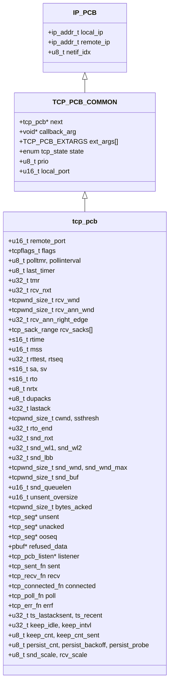

# 一、struct tcp_pcb 分层Mermaid结构图（VSCode可直接渲染）


# 二、整体结构分层说明
`struct tcp_pcb` 由**三层拼接**而成：
1. **IP_PCB 公共IP层字段**：所有TCP/UDP PCB共用，存放本地/远端IP、绑定网卡索引；
2. **TCP_PCB_COMMON TCP公共头部**：监听PCB、连接PCB共享字段（链表、状态、本地端口、用户参数）；
3. **TCP专属完整连接状态字段**：TCP独有序列号、滑动窗口、定时器、重传、拥塞控制、分段缓存、回调等（UDP无此部分）。

# 三、逐块详细拆解 struct tcp_pcb 全部字段
## 第一层：IP_PCB（隐式嵌入）
```c
ip_addr_t local_ip;    // 绑定本地IP，0.0.0.0代表监听所有网卡
ip_addr_t remote_ip;   // 对端连接IP
u8_t netif_idx;        // 绑定指定网卡索引，限制收发仅走该网卡
```

## 第二层：TCP_PCB_COMMON 公共TCP头部
```c
struct tcp_pcb *next;
```
全局TCP PCB单向链表指针，所有活跃TCP连接串在全局`tcp_pcbs`链表，IP收到TCP报文时遍历链表匹配五元组。

```c
void *callback_arg;
```
用户自定义透传参数，`tcp_arg()` 设置，所有回调函数第一个入参就是该值，区分多连接业务上下文。

```c
TCP_PCB_EXTARGS ext_args[];
```
可选扩展自定义数据数组，用于业务层挂载私有数据，配套创建/连接/销毁回调。

```c
enum tcp_state state;
```
TCP状态机（LISTEN / SYN_SENT / SYN_RCVD / ESTABLISHED / FIN_WAIT1 / FIN_WAIT2 / CLOSE_WAIT / LAST_ACK / CLOSING / CLOSED），TCP核心标识。

```c
u8_t prio;
```
PCB调度优先级，多连接同时发包时，高优先级连接优先输出报文。

```c
u16_t local_port;
```
本机绑定端口，主机字节序。

## 第三层：TCP连接独有字段（核心分段）
### 3.1 五元组远端端口
```c
u16_t remote_port;
```
对端TCP端口，主机字节序，匹配报文时和IP、本地端口组成完整五元组。

### 3.2 状态标志 flags（tcpflags_t）
位标记控制TCP行为，全部宏释义：
| 标志 | 作用 |
|------|------|
| TF_ACK_DELAY | 启用延迟ACK，不立刻回复ACK，合并多个ACK减少报文 |
| TF_ACK_NOW | 强制立即发送ACK（收到数据/乱序包时置位） |
| TF_INFR | 处于快速恢复拥塞阶段 |
| TF_CLOSEPEND | tcp_close发送FIN失败，定时器重试发送FIN |
| TF_RXCLOSED | 调用tcp_shutdown关闭接收方向，不再接收数据 |
| TF_FIN | 本地主动关闭，FIN报文已加入发送队列 |
| TF_NODELAY | 关闭Nagle算法，小包立即发送（低延迟场景） |
| TF_NAGLEMEMERR | Nagle开启但内存不足，强制输出避免延迟ACK死锁 |
| TF_WND_SCALE | 协商启用窗口缩放选项，支持超大滑动窗口 |
| TF_BACKLOGPEND | 被动连接占用监听PCB半连接队列 |
| TF_TIMESTAMP | 启用TCP时间戳选项，优化RTT计算、防序号绕回 |
| TF_RTO | RTO重传定时器触发，飞行数据移入重传队列 |
| TF_SACK | 启用选择性SACK，只重传丢失分段而非全部 |

### 3.3 通用定时器组
```c
u8_t polltmr, pollinterval;
```
poll轮询定时器：pollinterval为周期（单位TCP时钟节拍），polltmr倒计时，到点触发`tcp_poll`回调。

```c
u8_t last_timer;
u32_t tmr;
```
TCP全局总计时器，统一驱动重传、保活、持续探测等所有定时逻辑。

### 3.4 接收端滑动窗口 & 序列号（rcv_xxx）
```c
u32_t rcv_nxt;
```
下一个期望收到的有序序列号，核心接收基准。收到有序数据后递增，用于回复ACK。

```c
tcpwnd_size_t rcv_wnd;
```
本机剩余接收缓冲区可用字节数，决定能接收多少新数据。

```c
tcpwnd_size_t rcv_ann_wnd;
```
即将通过ACK告知对端的接收窗口大小。

```c
u32_t rcv_ann_right_edge;
```
通告窗口右边界 = rcv_nxt + rcv_ann_wnd，对端发送数据不能超过此序号。

```c
struct tcp_sack_range rcv_sacks[];
```
SACK选择性确认区间数组，记录乱序收到的分段范围，告诉对端哪些分段已收到、无需重传。

### 3.5 RTT/重传超时 RTO 相关
```c
s16_t rtime;
```
单次重传倒计时节拍。

```c
u16_t mss;
```
最大分段大小，单次TCP报文最大载荷字节，握手时协商。

```c
u32_t rttest;
u32_t rtseq;
s16_t sa, sv;
```
RTT往返时间估计算法（Jacobson标准）：
- rtseq：正在计时的发送序列号；
- rttest：本次RTT采样计时；
- sa：平滑RTT均值；sv：RTT偏差。

```c
s16_t rto;
```
重传超时时间，根据sa/sv动态调整。

```c
u8_t nrtx;
```
当前分段重传次数，达到上限直接断开连接。

### 3.6 快速重传 & 拥塞控制
```c
u8_t dupacks;
```
重复ACK计数，收到3次重复ACK触发快速重传。

```c
u32_t lastack;
```
收到的最高确认序列号，所有<=lastack的数据均已被对端接收。

```c
tcpwnd_size_t cwnd;
```
拥塞窗口，控制本机最多能同时发送多少未确认字节。

```c
tcpwnd_size_t ssthresh;
```
慢启动阈值：cwnd < ssthresh走慢启动；cwnd >= ssthresh走拥塞避免。

```c
u32_t rto_end;
```
上一轮RTO重传最后一个字节的序列号，标记重传数据区间。

### 3.7 发送端序列号 & 发送窗口（snd_xxx）
```c
u32_t snd_nxt;
```
下一个待发送新数据的起始序列号。

```c
u32_t snd_wl1, snd_wl2;
```
上次更新对端接收窗口时的序列号、ACK号，用于判断窗口更新是否有效。

```c
u32_t snd_lbb;
```
缓冲区中下一个待缓存数据的序列号，等于snd_nxt + 已缓存未发送总字节。

```c
tcpwnd_size_t snd_wnd;
```
对端通告的接收窗口大小，本机发送不能超过该窗口。

```c
tcpwnd_size_t snd_wnd_max;
```
连接生命周期内对端通告过的最大窗口，用于拥塞控制参考。

```c
tcpwnd_size_t snd_buf;
```
本机发送缓冲区剩余空闲字节，`tcp_write`前判断是否可写入数据。

```c
u16_t snd_queuelen;
```
发送队列pbuf分段总个数，限制内存占用。

```c
u16_t unsent_oversize;
```
TCP_OVERSIZE优化：最后一个未发送分段尾部可追加的空闲字节，减少pbuf分配。

```c
tcpwnd_size_t bytes_acked;
```
本轮ACK新增确认的字节数，用于触发`tcp_sent`回调。

### 3.8 三段分段缓存链表（TCP核心缓存）
```c
struct tcp_seg *unsent;
```
**未发送队列**：应用`tcp_write`写入、还未发送到网络的数据分段。

```c
struct tcp_seg *unacked;
```
**飞行重传队列**：已经发送、但还未收到对端ACK的分段，超时/重复ACK时重传。

```c
struct tcp_seg *ooseq;
```
**乱序分段缓存**：收到序号超前、不连续的数据包，暂存等待缺失分段补齐后再上交应用。

```c
struct pbuf *refused_data;
```
已收到有序数据，但应用未调用`tcp_recved`释放窗口，暂存的接收数据。

### 3.9 监听PCB关联
```c
struct tcp_pcb_listen* listener;
```
被动连接（服务端accept产生的连接PCB）指向创建它的监听PCB，用于半连接队列管理。

### 3.10 五层业务回调（lwIP回调式API核心）
```c
tcp_sent_fn sent;
```
数据被对端ACK确认后触发，参数len为本次确认字节，用于释放应用发送缓存。

```c
tcp_recv_fn recv;
```
收到有序完整数据触发，p为接收数据；p==NULL代表对端发送FIN关闭读通道。

```c
tcp_connected_fn connected;
```
客户端`tcp_connect`三次握手完成、连接建立成功触发。

```c
tcp_poll_fn poll;
```
周期定时触发，无数据收发也能执行业务轮询（心跳、定时发送）。

```c
tcp_err_fn errf;
```
连接异常销毁时触发（RST、超时、内存不足断开），回调执行时PCB已释放，不可操作pcb指针。

### 3.11 TCP时间戳选项
```c
u32_t ts_lastacksent;
u32_t ts_recent;
```
时间戳收发缓存，计算精准RTT，防止序列号绕回导致旧分段干扰新连接。

### 3.12 TCP Keepalive 保活定时器
```c
u32_t keep_idle;
```
空闲多久无数据才开始发送保活探测包。

```c
u32_t keep_intvl;
```
连续保活探测包之间的间隔。

```c
u8_t keep_cnt, keep_cnt_sent;
```
最大探测次数、当前已发送探测包计数，超过上限断开死连接。

### 3.13 Persist 持续探测定时器
对端接收窗口为0时，周期性发送1字节探测包，询问对端窗口是否恢复：
```c
u8_t persist_cnt;
u8_t persist_backoff;
u8_t persist_probe;
```

### 3.14 窗口缩放因子（Window Scale）
```c
u8_t snd_scale; // 发送端窗口缩放移位
u8_t rcv_scale; // 接收端窗口缩放移位
```
握手协商，将16位窗口扩展为32位超大窗口，适配高速大带宽链路。

# 四、tcp_pcb 和 udp_pcb 核心区别总结
1. **状态机**：tcp_pcb完整TCP十态状态机；udp_pcb无状态，仅绑定/连接标记；
2. **缓存队列**：tcp有unsent/unacked/ooseq三段分段链表，处理重传、乱序；udp无任何数据缓存；
3. **拥塞控制**：tcp携带cwnd、ssthresh、RTT/RTO全套拥塞控制参数；udp完全无拥塞逻辑；
4. **多回调**：tcp提供connect/sent/recv/poll/err五层回调；udp仅单一recv接收回调；
5. **定时器**：tcp内置重传、保活、持续探测、poll多套定时器；udp无专属定时器；
6. **序号窗口**：tcp全套收发序列号、滑动窗口、SACK；udp无序列号、无流量控制。