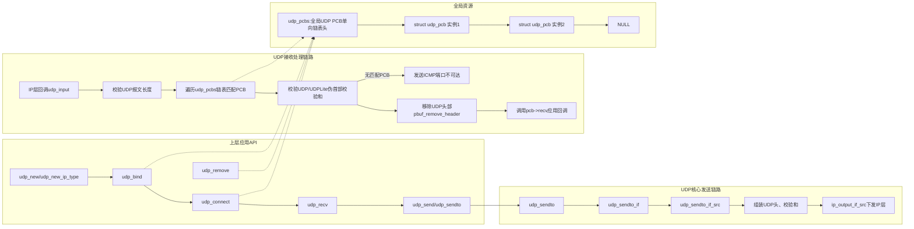
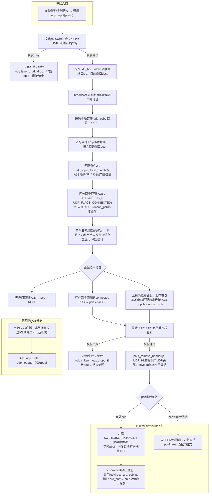
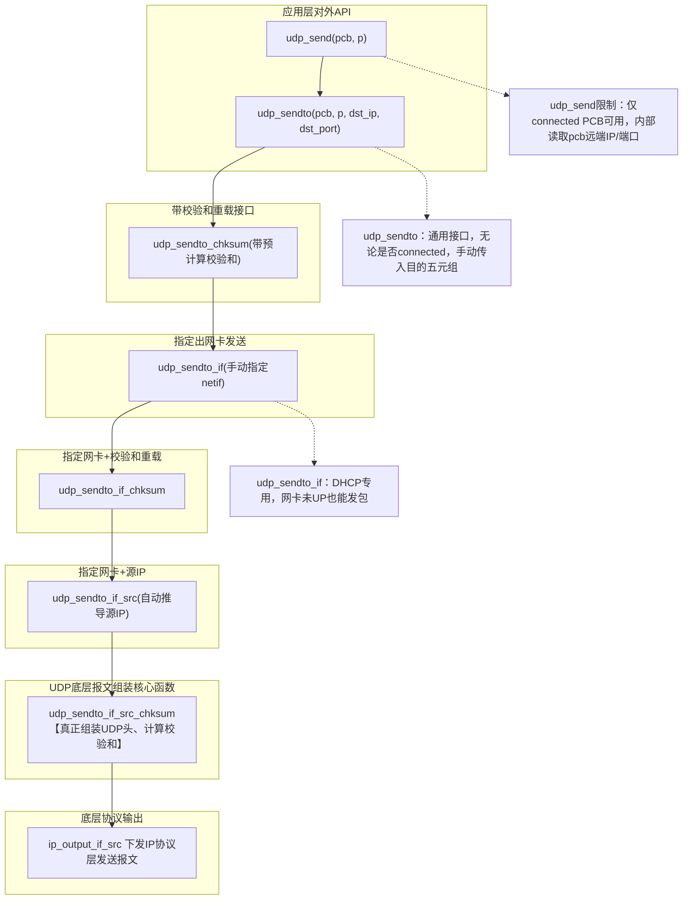
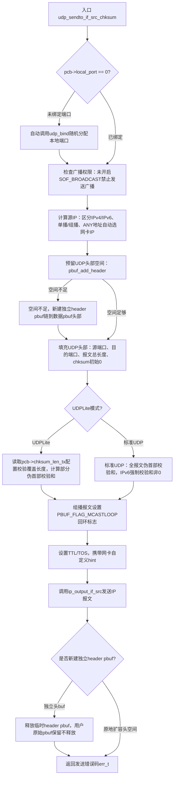

# lwIP udp.c 源码深度解析 + Mermaid流程图
## 一、整体模块架构Mermaid图

**注意**：

1. 完整报文上行流程

硬件网卡收包 → 链路层(eth_input) → IP层(ip_input)

        ↓（IP头里protocol=17(UDP)）

调用 UDP注册的回调 udp_input(pbuf, netif)  ←—— 这里就是「IP层回调」

        ↓

udp_input 处理UDP头部、匹配pcb、投递应用recv回调

2. PCB 完整讲解（lwIP 里的 udp_pcb）

（1） 全称

**PCB = Protocol Control Block**

中文：**协议控制块**

（2） 通俗一句话解释

操作系统 / lwIP 内核用来**记录一条UDP/TCP连接/套接字所有状态、配置、地址信息**的专属结构体，每打开一个UDP套接字，内核就分配一块PCB内存单独管理它。

你可以把 PCB 理解成：**UDP套接字在内核里的档案本**。

（3） 为什么需要 PCB？

一个程序可以同时开多个UDP端口、多个远端通信对象，lwIP 必须区分开每一路通信：

- 哪个本地IP、本地端口
- 连的哪个远端IP、远端端口
- 收数据时交给哪个应用回调函数
- TTL、广播权限、UDPLite、组播配置
- 绑定的网卡、缓存标记等
所有这些信息全部打包存在 `struct udp_pcb` 里，就是UDP PCB。 


# 二、struct udp_pcb 结构体完整详解
## 1. 结构体核心字段说明（结合源码宏）
UDP PCB（Protocol Control Block，协议控制块）是lwIP管理每一条UDP套接字的核心数据结构，所有收发、绑定、连接状态全部存在此结构体，全局链表`udp_pcbs`串联所有激活的UDP PCB。
```c
struct udp_pcb {
  // 链表指针：全局udp_pcbs单向链表
  struct udp_pcb *next;

  // 本地五元组信息
  ip_addr_t local_ip;    // 绑定本地IP，IP_ANY_TYPE表示监听所有地址
  u16_t local_port;      // 本地绑定端口，0代表未bind
  // 远端五元组信息
  ip_addr_t remote_ip;   // connect设置的对端IP
  u16_t remote_port;     // connect设置的对端端口

  // 接收回调：应用层注册的数据接收函数
  udp_recv_fn recv;
  void *recv_arg;        // 回调透传自定义参数

  // 标志位集合 UDP_FLAGS_*
  u8_t flags;
  // 标志宏定义
  // UDP_FLAGS_CONNECTED：已调用udp_connect，固定对端
  // UDP_FLAGS_UDPLITE：启用UDPLite(RFC3828)
  // UDP_FLAGS_MULTICAST_LOOP：组播本地回环
  // UDP_FLAGS_NOCHKSUM：关闭UDP校验和（IPv4专用）

  // UDPLite 校验和长度控制
  u16_t chksum_len_rx;   // 接收时校验覆盖长度
  u16_t chksum_len_tx;   // 发送时校验覆盖长度，0=全报文校验

  // 网络接口绑定
  u8_t netif_idx;        // 绑定指定netif索引，NETIF_NO_INDEX不绑定
#if LWIP_MULTICAST_TX_OPTIONS
  u8_t mcast_ifindex;    // 组播发送指定网卡索引
  ip4_addr_t mcast_ip4;  // IPv4组播源地址
#endif

  // IP报文参数
  u8_t ttl;              // 单播TTL，组播单独配置
  u8_t tos;              // IP TOS/DSCP字段

  // 网卡自定义发送Hint
  netif_hint_t netif_hints;
};
```
## 2. 关键字段业务逻辑拆解
1. **链表域 next**
   所有创建并bind/connect的udp_pcb挂载在全局静态链表`udp_pcbs`头部，udp_bind/udp_connect时插入链表，udp_remove从链表摘除并释放内存。
2. **local_ip + local_port（绑定信息）**
   - `local_ip=IP_ANY_TYPE`：0.0.0.0/::0，监听本机所有网卡所有IP；
   - `local_port=0`：调用udp_send时自动调用udp_bind随机分配动态端口；
   - udp_bind会校验端口冲突，开启SO_REUSEADDR可多PCB绑定同端口。
3. **remote_ip + remote_port + UDP_FLAGS_CONNECTED**
   udp_connect仅赋值这两个字段+置连接标志，**无任何网络报文**，属于本地软连接：
   - 连接后调用`udp_send`无需每次传入目的IP/端口；
   - 接收报文匹配时优先匹配connected PCB（精确五元组匹配）。
4. **recv + recv_arg**
   应用通过`udp_recv(pcb, callback, user_data)`注册；udp_input匹配PCB成功后，调用`pcb->recv(recv_arg, pcb, pbuf, 源IP, 源端口)`，pbuf生命周期交给应用层释放。
5. **flags 标志位**
   - `UDP_FLAGS_CONNECTED`：连接态标识，匹配报文时优先匹配；
   - `UDP_FLAGS_UDPLITE`：切换协议为UDPLite，支持自定义校验覆盖长度；
   - `UDP_FLAGS_MULTICAST_LOOP`：发送组播报文本地网卡回环接收；
   - `UDP_FLAGS_NOCHKSUM`：IPv4下关闭UDP校验和，IPv6强制校验和不可关闭。
6. **netif_idx**
   udp_bind_netif设置，限制收发报文只能走指定网卡；收报文仅匹配该网卡入包，发报文强制从该网卡输出。

# 三、udp_input() 接收函数完整流程解析 + Mermaid
## 1. udp_input 流程图

## 2. 逐段源码逻辑详解
### 阶段1：基础合法性校验
1. 入参：`struct pbuf *p`（payload指向UDP头部）、`struct netif *inp`（入网卡）；
2. 最小长度校验：UDP头部固定8字节，p->len不足直接丢弃，统计长度错误；
3. 提取UDP头`udp_hdr`，网络序端口转主机序`src/dest`。

### 阶段2：遍历UDP PCB链表匹配（核心 demultiplex 多路分发）
匹配优先级规则（从高到低）：
1. **完全匹配Connected PCB**：本地IP+本地端口 + 远端IP+远端端口完全匹配；
   - 匹配成功将该PCB移动到链表头部，缓存优化，下次报文匹配更快；
2. **未连接PCB(uncon_pcb)**：仅本地端口+本地IP匹配，无远端限制；
   - 广播场景优先匹配绑定网卡真实IP的PCB；
   - SO_REUSEADDR开启时优先匹配绑定固定IP而非0.0.0.0的PCB。

辅助匹配函数 `udp_input_local_match()` 作用：
- 校验PCB绑定网卡`netif_idx`是否和入网卡一致；
- 处理0.0.0.0全监听地址；
- IPv4广播权限校验（SOF_BROADCAST选项）；
- IPv4子网广播、全局广播地址匹配逻辑。

### 阶段3：校验和校验（区分UDP / UDPLite）
1. UDPLite（`ip_current_header_proto()==IP_PROTO_UDPLITE`）：
   - 头部len=0：校验整个报文；
   - len非0：校验至少覆盖UDP头部，长度非法直接丢弃；
   - 使用`ip_chksum_pseudo_partial`计算部分校验和；
2. 标准UDP：
   - IPv6强制校验和，校验和为0非法；
   - IPv4校验和为0代表不校验，跳过校验逻辑；
3. 校验失败：统计`udp.chkerr`，释放pbuf直接退出。

### 阶段4：剥离UDP头部，交付应用回调
`pbuf_remove_header(p, UDP_HLEN)` 将payload指针跳过UDP 8字节头，pbuf剩余仅应用数据；
1. 广播/组播 + SO_REUSEADDR开启：克隆多份pbuf，分发给所有监听同端口PCB；
2. 存在`pcb->recv`回调：把pbuf传入回调，**pbuf所有权交给应用**，内核不释放；
3. 无回调：内核直接free pbuf，报文丢弃。

### 阶段5：无匹配PCB兜底逻辑
报文目的端口无任何PCB监听：
- 报文非广播、非组播：构造ICMP端口不可达报文回复源主机；
- 统计`udp.noports`，释放pbuf结束处理。

## 3.抽象比喻

### （1）修正你的比喻，精准对应
把整个设备当成**快递中转站**
1. **网卡netif** = 中转站不同出入口：东门(eth0内网)、西门(eth1外网)；
2. **udp_pcb（PCB）** = 单独一家快递公司收件窗口（顺丰、中通、圆通，每一个PCB就是独立窗口）；
3. **网络报文UDP包** = 一件快递包裹，包裹外面贴着标签：收件门牌号(目的端口)、收件地址(目的IP)、寄件地址(源IP、源端口)、从哪个大门送进来(入网卡)；
4. **全局udp_pcbs链表** = 所有快递公司窗口排成一排。

#### 收快递（udp_input上行）逻辑
1. 包裹从东门/西门（入网卡）送到中转站；
2. 工作人员拿着包裹标签，挨个走一遍所有快递公司窗口（遍历PCB链表）；
3. 每个窗口有自己的规则：
   - 窗口绑定了东门（pcb->netif_idx）：只看东门进来的包裹，西门包裹直接拒收；
   - 窗口登记了专属门牌号（local_port）、收件地址（local_ip）；
   - 如果是签约客户（UDP_FLAGS_CONNECTED，connect过），还限定只收某一个寄件人发来的包裹（remote_ip/remote_port）；
4. 匹配成功：包裹交给这个窗口对应的业务员（应用层recv回调）；
5. 所有窗口都不收：回复“无此收件地址”（ICMP端口不可达）。

这里纠正你第一处偏差：
> 不是PCB主动匹配报文，是**中转站（协议栈）拿着报文，挨个挨个去匹配所有PCB窗口**，PCB只是存放“收件规则”的记录本，不会主动做匹配。

#### 发快递（udp_send下行）逻辑
1. 业务员要寄件，直接找到自己所属快递公司窗口（传入PCB指针）；
2. 窗口记录本（PCB）写死：寄件地址（local_ip）、寄件门牌号（local_port）、默认收件人（remote_ip/remote_port，connect才存在）；
3. 协议栈读取PCB里的地址信息，打印到快递单（组装UDP头部、IP头部）；
4. 如果窗口绑定了东门（netif_idx），强制从东门发出，否则自动选合适大门；
5. 包裹封装好，从对应网卡送出。

这里纠正你第二处偏差：
> 发送阶段**不存在“匹配报文”**，报文还没生成。是先读取PCB里的本地/远端地址信息，**用这些信息去生成报文头部**，而不是拿着现成报文和PCB比对。

### （2） 精简总结你的比喻，改成完全准确版本
PCB 相当于中转站里**独立快递公司的收件窗口规则本**：
1. 收包时：协议栈拿着收到的UDP包裹，对比每个PCB里记录的【允许入口网卡、本地IP、本地端口、限定寄件人】，符合规则就交给对应业务处理；
2. 发包时：协议栈读取PCB里记录的本机端口/IP、目标地址，用这些信息制作UDP包裹，按PCB绑定的网卡出口发送；
3. 一个PCB只负责一套端口/IP通信，互不干扰，就像不同快递公司只处理自己收件范围的包裹。

# 四、udp_send() / udp_sendto() 发送链路完整解析 + Mermaid
## 1. 发送API调用层级图

## 2. udp_sendto_if_src_chksum 核心发送流程图

## 3. 分层API功能说明
### 顶层API（应用直接调用）
1. `udp_send(pcb, p)`
   仅用于**connected状态PCB**，自动使用pcb保存的remote_ip/remote_port，底层封装udp_sendto。
   限制：pcb->remote_ip不能为ANY，否则返回ERR_VAL。
2. `udp_sendto(pcb, p, dst_ip, dst_port)`
   通用发送接口，无论PCB是否connected，手动指定目的地址端口；
   connected PCB调用此函数不会修改内部remote信息，仅临时使用传入dst。

### 中层路由选择API
1. `udp_sendto_if`
   手动指定发送网卡netif，DHCP场景专用（网卡未UP也可发送报文）；
2. `udp_sendto_if_src`
   手动指定源IP，上层封装自动根据网卡、PCB绑定IP推导src_ip。

### 底层真正组装报文：udp_sendto_if_src_chksum
所有发送函数最终收敛到此函数，完成UDP头组装、校验和计算，核心逻辑分6步：
#### 步骤1：自动绑定端口
pcb->local_port=0（未bind），内部调用`udp_bind(pcb, ANY, 0)`随机分配动态端口，分配失败直接返回错误。

#### 步骤2：广播权限校验
IPv4广播报文，若PCB未开启SOF_BROADCAST选项，直接返回ERR_VAL禁止发送。

#### 步骤3：自动选择源IP（IPv4/IPv6双栈兼容）
规则：
1. pcb绑定固定非ANY IP：源IP直接使用pcb->local_ip，校验网卡IP一致性；
2. pcb绑定ANY地址（0.0.0.0/::）：单播根据路由选网卡IP，组播直接使用出网卡主IP；
3. IPv6自动选择匹配目的网段的网卡全球单播地址。

#### 步骤4：分配UDP头部内存
UDP头部固定8字节，需要在pbuf数据前预留空间：
1. `pbuf_add_header(p, UDP_HLEN)`：优先在当前pbuf头部扩容；
2. 扩容失败：新建PBUF_RAM类型header pbuf，链在用户数据pbuf前方；
3. 发送完成后，临时header pbuf单独释放，**用户传入的pbuf不会被释放**，由应用管理生命周期。

#### 步骤5：填充UDP头部 + 计算校验和
1. 基础字段：源端口(本地绑定端口)、目的端口、报文总长度；
2. UDPLite分支：
   - pcb->chksum_len_tx=0：校验整个报文；
   - 自定义长度：仅校验头部+前N字节载荷，适配弱校验场景；
   - 校验和为0强制改为0xFFFF（RFC3828规定0代表无校验非法）；
3. 标准UDP分支：
   - IPv6强制计算校验和，结果0替换为0xFFFF；
   - IPv4开启UDP_NOCHKSUM可跳过校验，chksum置0；
4. 使用`ip_chksum_pseudo`/`ip_chksum_pseudo_partial`计算IP+UDP伪首部校验和（UDP校验和必须包含IP层源目IP）。

#### 步骤6：下发IP层并收尾
1. 填充TTL（组播使用单独配置的组播TTL，单播使用pcb->ttl）、TOS；
2. 调用`ip_output_if_src`输出IP报文；
3. 若使用临时header pbuf，发送后释放头部pbuf，用户pbuf保留；
4. 统计`udp.xmit`发送计数，返回IP层输出错误码（ERR_OK/ERR_MEM/ERR_RTE等）。

## 4. 关键特性补充
1. **pbuf所有权规则**
   所有udp_send系列函数**不会释放用户传入的pbuf**，多次发送需应用手动克隆pbuf；
2. **校验和卸载支持**
   LWIP_CHECKSUM_ON_COPY开启时支持硬件/上层预计算校验和，通过`udp_sendto_chksum`传入预计算值；
3. **多播控制**
   PCB标志`UDP_FLAGS_MULTICAST_LOOP`控制组播报文本地回环，mcast_ifindex指定组播出口网卡；
4. **错误码含义**
   - ERR_ARG：入参pcb/pbuf/IP为空；
   - ERR_VAL：IP版本不匹配、connected PCB无远端地址；
   - ERR_MEM：内存不足（header pbuf分配失败）；
   - ERR_RTE：无路由到目的IP、源IP非法。

# 五、整体核心设计总结
1. **PCB链表多路分发**
   全局单向链表管理所有UDP套接字，收报文时遍历链表按「连接态精确匹配 > 未连接本地端口匹配」优先级分发；
2. **软连接设计（udp_connect无报文）**
   仅本地记录五元组，简化send调用，接收时优先匹配连接PCB提升性能；
3. **pbuf零拷贝思想**
   发送时尽可能原地扩容UDP头部，无法扩容才新建临时头缓存，用户数据缓冲区不复制；
4. **双栈原生兼容**
   ip_addr_t统一地址结构，一套代码兼容IPv4/IPv6，通过IPADDR_TYPE区分协议栈；
5. **UDPLite扩展兼容**
   同文件实现标准UDP与UDPLite，通过pcb标志切换校验和覆盖逻辑，兼容RFC3828；
6. **回调异步模型**
   无中断阻塞接收，IP收到报文后同步调用udp_input，通过注册recv回调把数据抛给应用，典型lwIP回调式API设计。